# PHƯƠNG PHÁP GIAO DỊCH VPA (VOLUME PRICE ANALYSIS) THEO ANNA COULLING VÀ NỀN TẢNG WYCKOFF – ỨNG DỤNG THỰC TIỄN TRÊN THỊ TRƯỜNG CHỨNG KHOÁN VIỆT NAM 📊

---

## Lời Mở đầu: Giải mã Thị trường Chứng khoán Việt Nam bằng VPA và Wyckoff – Nâng tầm Chuyên môn Giao dịch Hàng ngày 💡

Trong thế giới đầu tư tài chính đầy biến động, việc chỉ đơn thuần theo dõi biến động giá cổ phiếu hàng ngày là chưa đủ để đạt được thành công bền vững. Để thực sự thấu hiểu và dự đoán những chuyển động phức tạp của thị trường, nhà đầu tư cần những công cụ phân tích sâu sắc hơn, có khả năng "đọc vị" những lực lượng vô hình đang chi phối cung cầu. Báo cáo này được biên soạn với mục tiêu trang bị cho các nhà đầu tư tại thị trường chứng khoán Việt Nam một hệ thống kiến thức chuyên sâu và toàn diện về phương pháp **Phân tích Giá và Khối lượng (Volume Price Analysis - VPA)**, chủ yếu dựa trên những đóng góp của **Anna Coulling**, và đặt trên nền tảng vững chắc của **phương pháp Wyckoff**. Các phương pháp này, dù có nguồn gốc từ hơn một thế kỷ trước, vẫn giữ nguyên giá trị trong việc giải mã hành vi của "**dòng tiền thông minh**" (**smart money**) – yếu tố then chốt quyết định hướng đi của thị trường.

Báo cáo này sẽ đi sâu vào từng khía cạnh của VPA và Wyckoff, từ những nguyên tắc cốt lõi đến các tín hiệu giao dịch cụ thể. Đặc biệt, báo cáo sẽ cung cấp các ví dụ thực tế chi tiết, bao gồm phân tích các diễn biến quá khứ đáng chú ý của VN-Index như giai đoạn phân phối đỉnh năm 2022, cũng như áp dụng trực tiếp các phương pháp này vào phân tích dữ liệu thị trường gần đây (giai đoạn giả định tháng 5 - tháng 6 năm 2025 từ dữ liệu cung cấp). Mục tiêu cuối cùng là giúp người đọc không chỉ hiểu rõ lý thuyết mà còn có thể tự mình áp dụng một cách thành thạo các kỹ thuật VPA và Wyckoff vào hoạt động giao dịch hàng ngày, từ đó nâng cao trình độ phân tích và trở thành một nhà giao dịch chuyên nghiệp hơn. Sự quan tâm ngày càng tăng đối với các phương pháp phân tích chuyên sâu như **VSA (Volume Spread Analysis)**, VPA và Wyckoff trong cộng đồng đầu tư Việt Nam phản ánh một nhu cầu thực sự về việc nâng cao trình độ phân tích, vượt qua những chỉ báo kỹ thuật thông thường để đạt được lợi thế cạnh tranh.

---

## Phần 1: Nền tảng Vững chắc: VPA theo Anna Coulling và Nguyên lý Wyckoff Bất biến 🧱

Để có thể ứng dụng VPA và Wyckoff một cách hiệu quả, việc nắm vững các khái niệm và nguyên lý nền tảng là điều kiện tiên quyết. Phần này sẽ làm rõ những yếu tố cốt lõi của VPA theo Anna Coulling và các quy luật bất biến của Wyckoff, tạo dựng một cơ sở kiến thức vững chắc cho các phân tích chuyên sâu hơn.

### **1.1. VPA theo Anna Coulling: "Đọc vị" Thị trường qua Giá và Khối lượng**

Phương pháp **Phân tích Giá và Khối lượng (VPA)** do **Anna Coulling** hệ thống hóa và phổ biến là một công cụ mạnh mẽ giúp nhà đầu tư nhìn thấu những động lực thực sự đằng sau các biến động giá.

-   **VPA là gì? Sức mạnh của sự kết hợp Giá và Khối lượng:**
    **Phân tích Giá và Khối lượng (VPA)** là một phương pháp phân tích kỹ thuật thị trường dựa trên sự tương tác phức tạp giữa **hành động giá (price action)**, các **mẫu hình nến (candlestick patterns)**, các **chu kỳ thị trường** và, quan trọng nhất, **khối lượng giao dịch (trading volume)**. Mục tiêu cốt lõi của VPA là nhận diện dấu chân của "**dòng tiền thông minh**" – bao gồm các nhà giao dịch nội bộ, các tổ chức lớn và các nhà tạo lập thị trường – để từ đó dự đoán hướng đi tiềm năng của thị trường. **Anna Coulling** đã có những đóng góp quan trọng trong việc làm rõ và hệ thống hóa VPA, đặc biệt nhấn mạnh tầm quan trọng của việc phân tích biểu đồ nến trong sự kết hợp chặt chẽ với khối lượng giao dịch tương ứng.

    VPA không chỉ dừng lại ở việc nhận diện các mẫu hình giá quen thuộc. Điểm độc đáo và sức mạnh của VPA nằm ở chỗ nó đòi hỏi sự xác nhận hoặc phủ nhận từ khối lượng giao dịch cho mỗi tín hiệu giá. Điều này nâng tầm phân tích từ việc quan sát hai chiều (giá và thời gian) lên ba chiều (giá, thời gian và khối lượng/sự thuyết phục). Chính chiều thứ ba này, được **Anna Coulling** đặc biệt chú trọng, là chìa khóa để "đọc vị" thị trường ở một mức độ sâu sắc hơn, hiểu được câu chuyện thực sự mà thị trường đang kể.

-   **Vai trò Cốt lõi của Khối lượng: "Máy Phát Hiện Nói Dối" Không Thể Bỏ Qua**
    Trong phương pháp VPA, khối lượng giao dịch được xem là "**máy phát hiện nói dối**" của thị trường, tiết lộ mức độ "thuyết phục" và sức mạnh thực sự đằng sau mỗi biến động giá. Khi giá tăng hoặc giảm một cách đáng kể, nếu đi kèm với khối lượng giao dịch cao hoặc tăng dần, điều đó cho thấy có một sự đồng thuận mạnh mẽ trên thị trường về hướng đi của giá và xu hướng hiện tại có khả năng tiếp diễn. Ngược lại, nếu giá tăng hoặc giảm mạnh nhưng khối lượng giao dịch lại thấp, đây có thể là một tín hiệu đáng ngờ, báo hiệu sự bất ổn, khả năng thao túng giá từ một số ít người chơi, hoặc đơn giản là xu hướng đó yếu và không bền vững.

    > **Anna Coulling** đã chỉ ra: *"Chỉ riêng giá không kể hết câu chuyện... chỉ riêng khối lượng thì đơn thuần tiết lộ sự quan tâm... Chỉ khi khối lượng và giá kết hợp với nhau, chúng ta mới có phản ứng hóa học tạo ra sức mạnh bùng nổ của Phân tích Giá Khối lượng"*.

    Hình ảnh "máy phát hiện nói dối" mang hàm ý sâu sắc rằng giá có thể bị các nhà giao dịch lớn (thường được gọi là "**smart money**" hay "**dòng tiền thông minh**") thao túng để tạo ra các tín hiệu giả. Tuy nhiên, việc thao túng khối lượng trên quy mô lớn là khó khăn và tốn kém hơn nhiều. Do đó, khối lượng thường phản ánh chân thực hơn ý định và hành động của các "tay chơi lớn" này. Việc hiểu rõ điều này giúp nhà đầu tư VPA lọc bỏ được nhiễu loạn từ các động thái giá đơn thuần và tập trung vào những tín hiệu có độ tin cậy cao hơn.

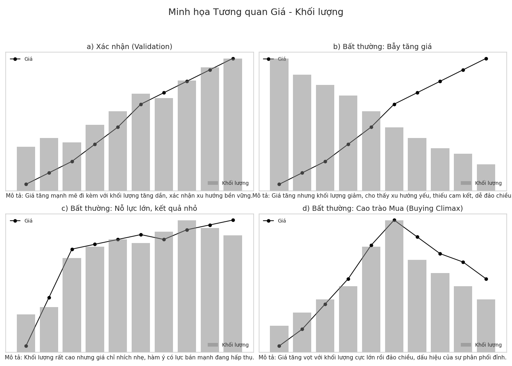
-   **Sự Tương Quan Giá-Khối Lượng: Xác nhận (Validation) và Bất thường (Anomaly)**
    Một trong những nguyên tắc nền tảng mà **Anna Coulling** nhấn mạnh là việc tìm kiếm sự **xác nhận (validation)** hoặc sự **bất thường (anomaly)** giữa hành động giá và khối lượng giao dịch.

    -   **Sự Xác nhận (Validation):** Khi giá và khối lượng di chuyển hài hòa, chúng xác nhận lẫn nhau. Ví dụ, giá tăng với biên độ nến mở rộng dần, đồng thời khối lượng giao dịch cũng tăng lên một cách tương ứng, điều này xác nhận một xu hướng tăng giá mạnh mẽ và bền vững. Tương tự, giá giảm với biên độ nến mở rộng và khối lượng tăng theo xác nhận một xu hướng giảm giá mạnh.
    -   **Sự Bất thường (Anomaly) / Mâu thuẫn:** Đây là khi giá và khối lượng kể những câu chuyện trái ngược nhau, thường là những tín hiệu cảnh báo sớm quan trọng.
        -   Giá tăng mạnh nhưng khối lượng thấp: "Kết quả" (giá tăng mạnh) không tương xứng với "nỗ lực" (khối lượng thấp). Đây có thể là **bẫy tăng giá (bull trap)** hoặc xu hướng tăng yếu, dễ đảo chiều.
        -   Giá tăng với biên độ nến hẹp nhưng khối lượng lại rất lớn: Cần một "nỗ lực" rất lớn (khối lượng cao) để giá chỉ nhích lên được một chút. Đây có thể là dấu hiệu của áp lực bán tiềm ẩn đang hiện hữu hoặc thị trường đang gặp phải một vùng kháng cự mạnh.
        -   Giá tăng với biên độ nến tăng dần nhưng khối lượng lại giảm dần: Xu hướng tăng đang mất dần động lực và có khả năng suy yếu do sự cam kết của bên mua giảm sút.
        -   Giá giảm với biên độ nến tăng dần nhưng khối lượng lại giảm dần: Đà giảm đang yếu dần, áp lực bán không còn mạnh mẽ.

        Những sự bất thường này chính là biểu hiện cụ thể của **Quy luật Nỗ lực và Kết quả** trong phương pháp Wyckoff. Khi "nỗ lực" (khối lượng) không tạo ra "kết quả" (biến động giá) tương xứng, đó thường là dấu hiệu cho thấy các nhà tạo lập thị trường đang hành động ngược lại với đám đông, hoặc thị trường đang mất đi động lực ban đầu. Việc nhận diện những bất thường này cho phép nhà đầu tư đánh giá được liệu một động thái giá có thực sự được hỗ trợ bởi dòng tiền lớn hay không, hay chỉ là một cái bẫy.

-   **VPA và Phân tích Nến Chuyên sâu:**
    Phương pháp VPA không chỉ nhìn vào giá đóng cửa mà còn phân tích sâu sắc toàn bộ cấu trúc của từng cây nến – thân nến, bóng nến, biên độ giá – trong mối tương quan mật thiết với khối lượng giao dịch tại thời điểm hình thành cây nến đó. Các mẫu hình nến kinh điển như **Hammer, Hanging Man, Doji chân dài, Shooting Star** đều được đánh giá lại một cách cẩn trọng dưới lăng kính của khối lượng để xác thực độ tin cậy.

    Ví dụ, một mẫu hình nến **Hammer** xuất hiện tại vùng đáy của một xu hướng giảm sẽ trở nên có ý nghĩa và đáng tin cậy hơn rất nhiều nếu nó đi kèm với khối lượng giao dịch cực lớn, thường được gọi là "**Stopping Volume**" (khối lượng dừng đà giảm). Khối lượng lớn này cho thấy một lực mua mạnh đã nhập cuộc để hấp thụ toàn bộ áp lực bán. Điều này minh chứng VPA nâng cao phân tích nến truyền thống: một nến Hammer hình thành trên nền khối lượng thấp có thể không mang nhiều ý nghĩa, thậm chí là tín hiệu giả; trong khi một nến Hammer với "**Stopping Volume**" lại là một tín hiệu mua tiềm năng rất mạnh mẽ. VPA khắc phục nhược điểm của việc chỉ tập trung vào hình thái nến mà bỏ qua yếu tố khối lượng, một thành phần tối quan trọng.

-   **Hỗ trợ và Kháng cự qua Lăng kính VPA:**
    **Anna Coulling** ví các mức **hỗ trợ** như "sàn nhà" và **kháng cự** như "trần nhà", chúng là những vùng tâm lý quan trọng phản ánh sự giằng co giữa sợ hãi và tham lam. Điểm mấu chốt trong VPA là tất cả các vùng hỗ trợ và kháng cự, cũng như các hành động giá tại những vùng này, đều phải được xác nhận bằng khối lượng giao dịch.

    Một sự **phá vỡ (breakout)** lên trên một mức kháng cự mạnh sẽ trở nên đáng tin cậy hơn nhiều nếu nó đi kèm với khối lượng giao dịch lớn và tăng đột biến, cho thấy lực cầu mạnh mẽ và sự cam kết thực sự từ bên mua. Ngược lại, nếu giá phá vỡ kháng cự nhưng khối lượng lại thấp hoặc suy yếu, đó có thể là một "**false breakout**" (phá vỡ giả). Tương tự, khi một mức kháng cự bị phá vỡ một cách thuyết phục (có khối lượng xác nhận), nó thường có xu hướng chuyển vai trò thành một mức hỗ trợ mới và ngược lại. Khối lượng tại các vùng hỗ trợ/kháng cự cho thấy mức độ cam kết của các bên tham gia thị trường trong việc bảo vệ hoặc phá vỡ các ngưỡng này. Một bài **kiểm tra (test)** lại mức hỗ trợ với khối lượng thấp cho thấy phe bán không còn hứng thú bán ở mức giá đó, củng cố sức mạnh của vùng hỗ trợ. Ngược lại, một nỗ lực phá vỡ kháng cự với khối lượng thấp mà thất bại cho thấy sự thiếu quyết tâm của phe mua.

### **1.2. Phương pháp Wyckoff: "Giải phẫu" Hành vi Thị trường**

**Richard D. Wyckoff** là một trong những người tiên phong trong lĩnh vực phân tích kỹ thuật, và phương pháp của ông cung cấp một khung lý thuyết vững chắc để hiểu được logic đằng sau các biến động thị trường.

-   **Richard Wyckoff và Di sản Vượt Thời gian:**
    **Richard D. Wyckoff (1873-1934)** không chỉ quan sát biểu đồ giá mà còn đi sâu vào việc tìm hiểu vai trò của các nhà đầu tư lớn, có tổ chức. Công trình của ông tập trung vào việc xác định sự can thiệp và hành động của "**dòng tiền thông minh**" để tìm kiếm cơ hội giao dịch.

-   **Ba Quy luật Nền tảng của Wyckoff:**
    Phương pháp Wyckoff được xây dựng trên ba quy luật cơ bản, đóng vai trò như những trụ cột cho toàn bộ hệ thống phân tích, bao gồm cả VPA.
    -   **Quy luật Cung và Cầu (Law of Supply and Demand):** Đây là quy luật cơ bản nhất. Khi Cầu lớn hơn Cung, giá tăng; khi Cung lớn hơn Cầu, giá giảm; khi Cung và Cầu cân bằng, giá đi ngang. VPA sử dụng phân tích giá và khối lượng để đánh giá trực quan mối quan hệ này.
    -   **Quy luật Nguyên nhân và Kết quả (Law of Cause and Effect):** Để có một "Kết quả" (một xu hướng tăng hoặc giảm giá đáng kể) thì trước đó phải có một "Nguyên nhân" (giai đoạn tích lũy hoặc phân phối) tương xứng. Một giai đoạn tích lũy kéo dài và quy mô lớn (Nguyên nhân lớn) sẽ tạo tiền đề cho một xu hướng tăng giá mạnh mẽ và kéo dài sau đó (Kết quả lớn), và ngược lại đối với giai đoạn phân phối. Quy luật này nhấn mạnh tầm quan trọng của sự kiên nhẫn. Một xu hướng lớn không thể hình thành từ một giai đoạn chuẩn bị ngắn ngủi, sơ sài. Việc cố gắng tham gia thị trường khi "Nguyên nhân" chưa đủ lớn thường dẫn đến thất bại. Nhà đầu tư cần chờ đợi cho đến khi quá trình tích lũy (hoặc phân phối) cho thấy những dấu hiệu hoàn thiện trước khi kỳ vọng vào một động thái giá đáng kể.
    -   **Quy luật Nỗ lực và Kết quả (Law of Effort versus Result):** Mọi "Nỗ lực" (thể hiện chủ yếu qua khối lượng giao dịch) phải tạo ra một "Kết quả" (biến động giá) tương xứng. Sự hài hòa giữa giá và khối lượng cho thấy xu hướng có khả năng tiếp diễn. Ngược lại, sự phân kỳ hoặc bất thường giữa khối lượng và giá là một tín hiệu cảnh báo sớm quan trọng. Đây chính là quy luật mà VPA của **Anna Coulling** vận dụng một cách trực tiếp và hiệu quả nhất. Ví dụ, nếu thị trường tạo đỉnh mới (kết quả) nhưng với khối lượng giao dịch thấp hơn đáng kể so với đỉnh trước đó (ít nỗ lực hơn), đó là một cảnh báo rằng lực mua đang suy yếu và xu hướng tăng có thể sắp kết thúc. Ngược lại, nếu khối lượng giao dịch rất lớn (nỗ lực lớn) nhưng giá chỉ dao động trong biên độ hẹp hoặc không tăng tương xứng (kết quả nhỏ), điều này cho thấy có một lực cản đáng kể (ví dụ, áp lực bán mạnh đang hấp thụ lực mua).

-   **"Composite Man" (Người Vận Hành Phía Sau): Thấu hiểu Ý đồ của Dòng tiền Thông minh**
    Wyckoff giới thiệu khái niệm "**Composite Man**" **(CM)** – một thực thể tưởng tượng đại diện cho tập hợp các nhà đầu tư lớn, tổ chức tài chính, và những "tay chơi" có tiềm lực mạnh mẽ và thông tin tốt trên thị trường ("**dòng tiền thông minh**"). CM hành động một cách lý trí, có kế hoạch: âm thầm **tích lũy (mua gom)** tài sản ở giá thấp, sau đó đẩy giá lên và **phân phối (bán ra)** ở giá cao cho đám đông nhà đầu tư nhỏ lẻ. Mục tiêu của nhà đầu tư theo trường phái Wyckoff và VPA là nhận diện dấu vết hành động của CM qua phân tích giá và khối lượng, từ đó cố gắng giao dịch đồng bộ với họ.

    Do nhu cầu giao dịch với khối lượng rất lớn, CM không thể che giấu hoàn toàn hành động của mình; những dấu chân này sẽ để lại trên biểu đồ giá và đặc biệt là khối lượng. Việc hình dung về một "đối thủ" thông minh, có tính toán đang vận hành thị trường giúp giải thích nhiều động thái giá có vẻ phi lý như các cú "**rũ bỏ**" (**shakeout**) hay "**bẫy giá**" (**traps**). Chẳng hạn, một cú giảm giá đột ngột xuống dưới một mức hỗ trợ rõ ràng, sau đó nhanh chóng hồi phục mạnh mẽ (gọi là **Spring**), thường là một chiến thuật của CM để loại bỏ những nhà đầu tư yếu đuối, kích hoạt lệnh dừng lỗ của họ (tạo thanh khoản cho CM mua vào), và gom thêm hàng ở giá thấp trước khi bắt đầu một đợt tăng giá thực sự.

-   **Chu kỳ Thị trường Wyckoff: Bản đồ Hành trình của Giá**
    Theo Wyckoff, thị trường vận động theo các chu kỳ lặp đi lặp lại, bao gồm bốn giai đoạn chính: **Tích lũy (Accumulation)**, **Tăng giá (Markup)**, **Phân phối (Distribution)**, và **Giảm giá (Markdown)**. Việc hiểu rõ thị trường đang ở giai đoạn nào của chu kỳ là vô cùng quan trọng.

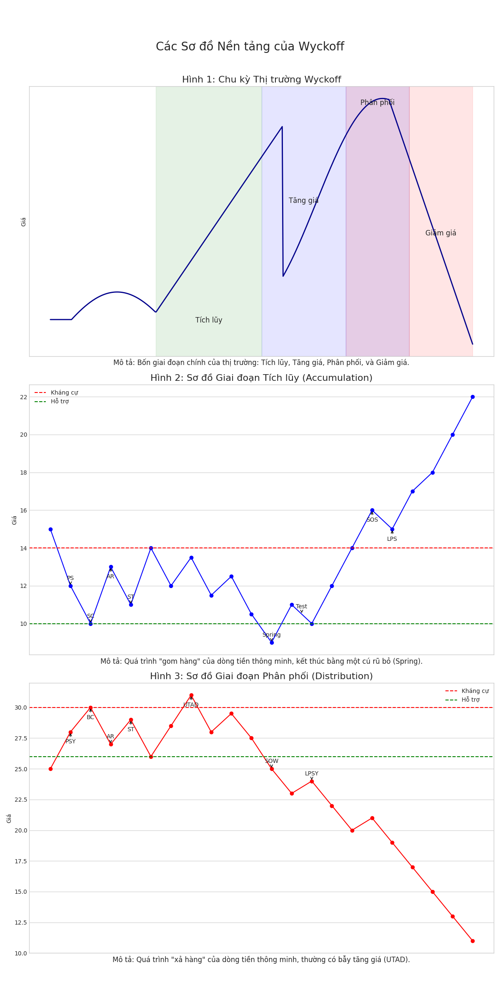
    Chu kỳ Wyckoff cung cấp một bức tranh tổng thể. Các tín hiệu VPA và sự kiện Wyckoff riêng lẻ sẽ có ý nghĩa lớn hơn khi được đặt trong bối cảnh của giai đoạn thị trường hiện tại. Ví dụ, một tín hiệu "**No Supply**" (không có nguồn cung) sẽ đáng tin cậy hơn nhiều nếu nó xuất hiện ở cuối giai đoạn Tích lũy, báo hiệu thị trường sẵn sàng cho giai đoạn Tăng giá, hơn là khi nó xuất hiện một cách đơn độc giữa một xu hướng Giảm giá mạnh. Việc nhận biết thị trường đang chuẩn bị cho một xu hướng tăng (Tích lũy) hay một xu hướng giảm (Phân phối) giúp nhà đầu tư lựa chọn chiến lược phù hợp, thay vì đi ngược lại dòng chảy chính của thị trường.

---

## Phần 2: "Giải phẫu" Chi tiết các Giai đoạn Wyckoff và Tín hiệu VPA Quan trọng 🔬

Phần này sẽ đi sâu vào cấu trúc của từng giai đoạn trong chu kỳ Wyckoff, mô tả các sự kiện chính và các tín hiệu VPA đặc trưng giúp nhà đầu tư nhận diện chúng trên biểu đồ.

### **2.1. Giai đoạn Tích lũy (Accumulation): Nhận diện "Tay To" Gom Hàng**

Mục tiêu chính của "**Composite Man**" (CM) trong giai đoạn này là mua gom một lượng lớn cổ phiếu ở mức giá thấp mà không gây ra sự chú ý đáng kể, chuẩn bị cho một xu hướng tăng giá sau đó. Giai đoạn này thường diễn ra sau một xu hướng giảm kéo dài.

-   **Phase A: Ngừng Xu hướng Giảm Trước Đó**
    -   **PS (Preliminary Support – Hỗ trợ Sơ bộ):** Những dấu hiệu đầu tiên cho thấy lực mua bắt đầu xuất hiện sau một đợt giảm giá kéo dài. Khối lượng giao dịch có thể tăng lên và biên độ giá có thể mở rộng, báo hiệu xu hướng giảm có thể đang đến hồi kết.
    -   **SC (Selling Climax – Cao trào Bán):** Áp lực bán đạt đến đỉnh điểm, thường đi kèm với sự hoảng loạn của công chúng bán tháo. Khối lượng giao dịch tại SC thường rất lớn, biên độ giá rất rộng. Tuy nhiên, giá thường đóng cửa hồi phục mạnh mẽ từ mức thấp nhất trong phiên, cho thấy CM đã bắt đầu hấp thụ một lượng lớn cổ phiếu.
    -   **AR (Automatic Rally – Hồi phục Tự động):** Sau khi lực bán cạn kiệt tại SC, một lực mua nhỏ cũng có thể dễ dàng đẩy giá lên. Đỉnh của đợt AR này thường giúp xác định biên trên (kháng cự) của **Vùng Giao Dịch Tích Lũy (Trading Range - TR)** sẽ hình thành sau đó.
    -   **ST (Secondary Test in Phase A – Kiểm tra Thứ cấp trong Pha A):** Giá quay trở lại kiểm tra vùng giá của SC. Nếu đáy SC vững chắc, khối lượng giao dịch và biên độ giá trong đợt ST này thường sẽ hẹp hơn đáng kể so với SC.

-   **Phase B: Xây dựng "Nguyên nhân"**
    Đây thường là giai đoạn kéo dài nhất. Giá sẽ dao động lên xuống bên trong TR được xác định bởi AR và SC/ST. Trong suốt Pha B, CM tiếp tục âm thầm mua gom cổ phiếu. Các đợt tăng giá trong Pha B có thể đi kèm với khối lượng tăng, trong khi các đợt giảm giá điều chỉnh thường có khối lượng giảm dần, cho thấy lực cung đang dần bị hấp thụ. Các tín hiệu VPA cần theo dõi bao gồm "**Test for Supply**" (giá giảm về hỗ trợ trên khối lượng thấp) hoặc "**No Supply**" (khối lượng cạn kiệt khi giá giảm nhẹ).

-   **Phase C: Kiểm tra Quyết định (The Test)**
    Đây là giai đoạn CM thực hiện một bài kiểm tra cuối cùng đối với nguồn cung.
    -   **Spring (Cú rũ bỏ)** hoặc **Shakeout (Cú lắc mạnh):** Giá đột ngột phá vỡ xuống dưới đường hỗ trợ của TR (bẫy giảm giá), nhằm loại bỏ những nhà đầu tư nắm giữ yếu (weak hands) và tạo thanh khoản cho CM mua thêm ở giá thấp. Sau đó, giá nhanh chóng hồi phục và đóng cửa trở lại bên trong TR.
    -   **Test of Spring/Shakeout (Kiểm tra Spring/Shakeout):** Sau Spring, thường sẽ có một hoặc nhiều đợt kiểm tra lại vùng đáy vừa tạo ra. Một bài kiểm tra thành công thường có đặc điểm là giá giảm xuống vùng đáy đó với biên độ hẹp và khối lượng giao dịch rất thấp, cho thấy lực bán đã hoàn toàn cạn kiệt. Một test thành công thường tạo ra một **đáy cao hơn (higher low)** so với đáy của Spring/Shakeout và là một trong những tín hiệu mua mạnh mẽ nhất.

-   **Phase D: Xác nhận Xu hướng Tăng**
    Sau khi nguồn cung đã được kiểm tra kỹ lưỡng, thị trường sẵn sàng cho xu hướng tăng.
    -   **SOS (Sign of Strength – Dấu hiệu Sức mạnh) / JAC (Jump Across the Creek – Nhảy qua Suối):** Giá bắt đầu tăng mạnh mẽ, phá vỡ lên trên đường kháng cự của TR. Đợt tăng giá này thường đi kèm với biên độ nến rộng và khối lượng giao dịch tăng lên đáng kể, cho thấy lực cầu đang hoàn toàn kiểm soát.
    -   **LPS (Last Point of Support – Điểm Hỗ trợ Cuối cùng) / BU (Back-up to the Edge of the Creek - BUEC):** Sau SOS, thường sẽ có những đợt điều chỉnh giảm nhẹ (pullback) trở lại vùng TR vừa bị phá vỡ (kháng cự cũ thành hỗ trợ mới). Các đáy của những đợt điều chỉnh này, nếu đi kèm với biên độ nến hẹp và khối lượng giao dịch thấp, được gọi là LPS và là cơ hội mua vào tốt trước khi giá tiếp tục tăng mạnh.

-   **Phase E: Giai đoạn Tăng giá (Markup)**
    Giá chính thức thoát khỏi Vùng Giao Dịch Tích Lũy và bắt đầu một xu hướng tăng giá rõ rệt.

-   **Bảng Tóm tắt các Sự kiện trong Giai đoạn Tích lũy Wyckoff**
    Bảng tổng hợp này cung cấp một cái nhìn tổng quan và nhanh chóng về trình tự cũng như ý nghĩa của từng sự kiện trong giai đoạn tích lũy. Nó đóng vai trò như một danh sách kiểm tra (checklist) cho nhà giao dịch khi xác định giai đoạn quan trọng này của thị trường, nơi nền tảng cho một xu hướng tăng mới được xây dựng. Việc nhận diện chính xác các pha và sự kiện như SC, Spring, SOS, LPS cho phép nhà giao dịch tìm được những điểm vào lệnh có rủi ro thấp trước khi đợt tăng giá lớn bắt đầu. Bảng này, vì vậy, hoạt động như một bản đồ tinh thần để điều hướng trong giai đoạn này.

| Sự kiện                                   | Mô tả ngắn gọn                                                                          | Ý nghĩa/Hàm ý cho nhà giao dịch                                                                                                   |
| ----------------------------------------- | ---------------------------------------------------------------------------------------- | --------------------------------------------------------------------------------------------------------------------------------- |
| **PS (Hỗ trợ Sơ bộ)**                      | Lực mua bắt đầu xuất hiện sau xu hướng giảm, khối lượng có thể tăng.                      | Dấu hiệu sớm xu hướng giảm có thể kết thúc. Chưa phải tín hiệu mua.                                                                |
| **SC (Cao trào Bán)**                     | Áp lực bán đạt đỉnh, hoảng loạn, khối lượng rất lớn, giá đóng cửa hồi phục từ đáy.       | Dấu hiệu cạn kiệt bán, "**Composite Man**" bắt đầu hấp thụ. Quan sát sự hình thành đáy tiềm năng.                                  |
| **AR (Hồi phục Tự động)**                 | Giá tăng lên sau SC do lực bán yếu đi, xác định biên trên của TR.                        | Xác nhận SC, thiết lập vùng kháng cự ban đầu của TR.                                                                               |
| **ST (Kiểm tra Thứ cấp)**                  | Giá kiểm tra lại vùng SC, khối lượng và spread thường hẹp hơn nếu đáy được xác nhận.     | Xác nhận lực bán yếu đi tại vùng đáy. Có thể có nhiều ST.                                                                           |
| **Spring/Shakeout**                       | Giá phá vỡ giả xuống dưới hỗ trợ TR rồi nhanh chóng hồi phục vào trong TR.              | Bẫy giảm giá, loại bỏ weak hands, cơ hội mua tiềm năng nếu được xác nhận bởi Test.                                                |
| **Test (Kiểm tra)**                       | Sau Spring/Shakeout, giá kiểm tra lại đáy Spring với khối lượng thấp, spread hẹp.        | Xác nhận lực bán đã cạn kiệt, thị trường sẵn sàng tăng. Tín hiệu mua mạnh nếu test thành công (đáy cao hơn, khối lượng rất thấp). |
| **SOS (Dấu hiệu Sức mạnh)**                | Giá tăng mạnh vượt lên trên TR, spread rộng, khối lượng tăng.                            | Xác nhận lực cầu kiểm soát, bắt đầu xu hướng tăng.                                                                                |
| **LPS (Điểm Hỗ trợ Cuối cùng) / BU/BUEC** | Giá điều chỉnh (pullback) về vùng TR vừa phá vỡ (kháng cự cũ thành hỗ trợ mới), spread hẹp, khối lượng thấp. | Cơ hội mua tốt cuối cùng trước khi giá tăng mạnh. Xác nhận hỗ trợ mới.                                                             |
| *(Nguồn: Tổng hợp từ )*                    |                                                                                          |                                                                                                                                   |

### **2.2. Giai đoạn Tăng giá (Markup): Đồng hành cùng Xu hướng**

Sau khi giai đoạn tích lũy hoàn tất, thị trường bước vào giai đoạn tăng giá (**Markup**). Đặc điểm chính của giai đoạn này là một xu hướng tăng rõ ràng, với lực cầu chiếm ưu thế vượt trội so với lực cung. Trong suốt giai đoạn này, khối lượng giao dịch thường nên xác nhận các đợt tăng giá; nghĩa là, giá tăng nên đi kèm với khối lượng tăng hoặc ít nhất là duy trì ở mức khá. Các đợt điều chỉnh giảm (**pullbacks**) trong một xu hướng tăng mạnh thường diễn ra trên khối lượng giao dịch giảm dần. Điều này cho thấy rằng đợt giảm chỉ là do hoạt động chốt lời của một số nhà đầu tư, chứ không phải do áp lực bán mới đáng kể từ "**dòng tiền thông minh**". Sau đó, lực mua mới nên xuất hiện trở lại và đẩy giá lên cao hơn, thường đi kèm với khối lượng tăng trở lại. Các tín hiệu VPA cần theo dõi trong giai đoạn này bao gồm "**Effort to Rise**" (Nỗ lực Tăng giá – nến tăng, biên độ rộng, khối lượng cao), "**No Supply**" (Không có Nguồn Cung – trên các đợt pullback, cho thấy lực bán yếu), và "**Test for Supply**" (Kiểm tra Nguồn Cung) thành công trên các đợt pullback. Nếu giá tăng mà khối lượng yếu, hoặc các đợt pullback diễn ra với khối lượng lớn, đó là những dấu hiệu cảnh báo rằng giai đoạn tăng giá có thể đang gặp khó khăn hoặc giai đoạn phân phối có thể bắt đầu sớm hơn dự kiến. Đôi khi, trong giai đoạn tăng giá có thể xuất hiện các giai đoạn đi ngang ngắn, được gọi là **tái tích lũy (re-accumulation)**, trước khi giá tiếp tục xu hướng tăng.

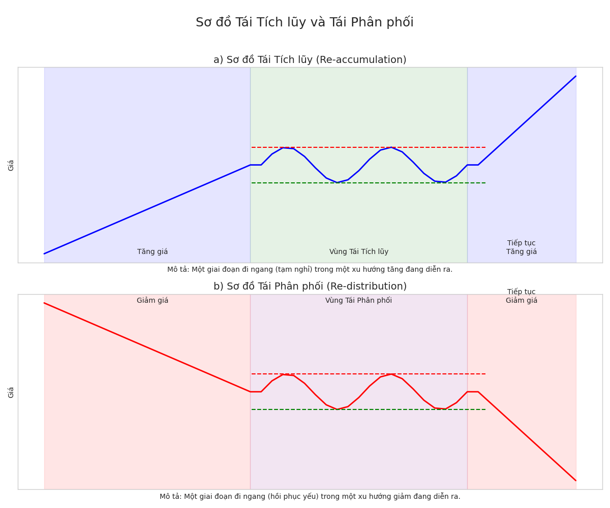
### **2.3. Giai đoạn Phân phối (Distribution): Dấu hiệu "Tay To" Xả Hàng**

Khi giá đã tăng đến một mức độ mà CM cho là đủ hấp dẫn để chốt lời, họ bắt đầu quá trình bán ra số tài sản đã tích lũy trước đó. Giai đoạn này thường hình thành một vùng giao dịch đi ngang ở vùng đỉnh của thị trường.

-   **Phase A: Ngừng Xu hướng Tăng Trước Đó**
    -   **PSY (Preliminary Supply – Cung Sơ khởi):** Sau một xu hướng tăng mạnh, những dấu hiệu đầu tiên của lực bán bắt đầu xuất hiện. Khối lượng giao dịch có thể tăng lên, cho thấy CM bắt đầu thăm dò việc bán ra.
    -   **BC (Buying Climax – Cao trào Mua):** Lực mua của công chúng đạt đến đỉnh điểm, thường đi kèm với sự hưng phấn tột độ. Khối lượng giao dịch tại BC thường rất lớn, biên độ giá rộng. Tuy nhiên, CM lại tận dụng cơ hội này để phân phối một lượng lớn cổ phiếu. Giá thường không giữ được mức cao nhất trong phiên và có thể đóng cửa thấp hơn đáng kể.
    -   **AR (Automatic Reaction – Phản ứng Giảm Tự động):** Sau khi lực mua cạn kiệt tại BC, một lực bán nhỏ cũng có thể dễ dàng đẩy giá xuống. Đáy của đợt AR này thường giúp xác định biên dưới (hỗ trợ) của **Vùng Giao Dịch Phân Phối (TR)**.
    -   **ST (Secondary Test in Phase A – Kiểm tra Thứ cấp trong Pha A):** Giá hồi phục lên để kiểm tra lại vùng giá của BC. Nếu đỉnh BC được xác nhận, khối lượng giao dịch và biên độ giá trong đợt ST này thường sẽ hẹp hơn so với BC. Một ST cũng có thể ở dạng một **Upthrust (UT)** – một cú đẩy giá lên trên BC nhưng thất bại.

-   **Phase B: Xây dựng "Nguyên nhân" cho Xu hướng Giảm**
    Tương tự Pha B của tích lũy, đây thường là giai đoạn kéo dài nhất. Giá dao động trong TR. CM tiếp tục âm thầm phân phối cổ phiếu. Có thể có nhiều nỗ lực đẩy giá lên (rally) trong Pha B, thường được gọi là các **Upthrusts (UT)** hoặc các ST ở dạng UT, nhằm tạo ra các **bẫy tăng giá (bull traps)** để thu hút thêm người mua và để CM bán thêm cổ phiếu ở giá cao. Khối lượng giao dịch thường thất thường. Các tín hiệu VPA cần theo dõi là "**Upthrusts**" (giá đẩy lên rồi thất bại trên khối lượng cao hoặc trung bình) và "**No Demand**" (nến tăng, biên độ hẹp, khối lượng thấp khi giá tiếp cận kháng cự).

-   **Phase C: Kiểm tra Quyết định (Thường là UTAD)**
    CM thực hiện một bài kiểm tra cuối cùng đối với lực cầu.
    -   **UTAD (Upthrust After Distribution – Đẩy lên Sau Phân phối):** Đây thường là một cú đẩy giá lên mạnh mẽ cuối cùng, một cái bẫy tăng giá điển hình. Giá đột ngột phá vỡ lên trên đường kháng cự của TR, tạo cảm giác xu hướng tăng sẽ tiếp tục. Tuy nhiên, sau khi "bẫy" thành công, giá nhanh chóng suy yếu, không duy trì được ở mức cao mới và rơi trở lại vào bên trong TR, hoặc thậm chí giảm mạnh hơn nữa. UTAD thường đi kèm với khối lượng lớn tại điểm phá vỡ giả và là tín hiệu bán rất mạnh.

-   **Phase D: Xác nhận Xu hướng Giảm**
    Sau khi lực cầu đã bị kiểm tra và cho thấy sự yếu kém, thị trường sẵn sàng cho xu hướng giảm.
    -   **SOW (Sign of Weakness – Dấu hiệu Yếu kém):** Giá bắt đầu giảm mạnh, phá vỡ xuống dưới đường hỗ trợ của TR. Đợt giảm giá này thường đi kèm với biên độ nến rộng và khối lượng giao dịch tăng lên đáng kể, cho thấy lực cung đang hoàn toàn kiểm soát.
    -   **LPSY (Last Point of Supply – Điểm Cung Cuối cùng):** Sau SOW, thường sẽ có những đợt hồi phục yếu ớt (rally) trở lại vùng TR vừa bị phá vỡ (hỗ trợ cũ thành kháng cự mới). Các đỉnh của những đợt hồi phục này, nếu đi kèm với biên độ nến hẹp và khối lượng giao dịch thấp (hoặc khối lượng tăng nhưng giá không thể vượt qua được kháng cự), được gọi là LPSY. Đây là những cơ hội bán (hoặc bán khống) cuối cùng rất tốt.

-   **Phase E: Giai đoạn Giảm giá (Markdown)**
    Giá chính thức thoát khỏi Vùng Giao Dịch Phân Phối và bắt đầu một xu hướng giảm giá rõ rệt.

-   **Bảng Tóm tắt các Sự kiện trong Giai đoạn Phân phối Wyckoff**
    Bảng này đóng vai trò là một hướng dẫn tham khảo nhanh về chuỗi các sự kiện và tầm quan trọng của chúng trong giai đoạn phân phối. Nó hỗ trợ các nhà giao dịch trong việc xây dựng một danh sách kiểm tra để xác định giai đoạn đỉnh quan trọng này của thị trường. Việc nhận biết được giai đoạn phân phối, nơi dòng tiền thông minh đang bán ra cho công chúng thiếu cảnh giác trước một đợt suy giảm giá, là cực kỳ quan trọng. Việc xác định chính xác các giai đoạn và sự kiện như BC, UTAD, SOW và LPSY cho phép các nhà giao dịch bảo vệ vốn và có khả năng bắt đầu các vị thế bán. Do đó, bảng này hoạt động như một bản đồ nhận thức để định hướng trong giai đoạn này.

| Sự kiện                                                  | Mô tả ngắn gọn                                                                                                                  | Ý nghĩa/Hàm ý cho nhà giao dịch                                                                                                        |
| -------------------------------------------------------- | ------------------------------------------------------------------------------------------------------------------------------- | -------------------------------------------------------------------------------------------------------------------------------------- |
| **PSY (Cung Sơ khởi)**                                     | Lực bán bắt đầu xuất hiện sau xu hướng tăng, khối lượng có thể tăng.                                                             | Dấu hiệu sớm xu hướng tăng có thể chững lại. Chưa phải tín hiệu bán.                                                                    |
| **BC (Cao trào Mua)**                                      | Lực mua đạt đỉnh, hưng phấn, khối lượng rất lớn, giá thường không giữ được đỉnh.                                                 | Dấu hiệu hưng phấn cực độ, "**Composite Man**" bắt đầu phân phối mạnh. Quan sát sự hình thành đỉnh tiềm năng.                         |
| **AR (Phản ứng Giảm Tự động)**                             | Giá giảm xuống sau BC do lực mua yếu đi, xác định biên dưới của TR.                                                              | Xác nhận BC, thiết lập vùng hỗ trợ ban đầu của TR.                                                                                     |
| **ST (Kiểm tra Thứ cấp)**                                  | Giá hồi phục kiểm tra lại vùng BC, khối lượng và spread thường hẹp hơn nếu đỉnh được xác nhận. Có thể là UT.                       | Xác nhận lực cầu yếu đi tại vùng đỉnh. Có thể có nhiều ST.                                                                              |
| **UT/UTAD (Upthrust / Upthrust After Distribution)**       | Giá phá vỡ giả lên trên kháng cự TR rồi nhanh chóng suy yếu, rơi lại vào TR hoặc giảm mạnh hơn.                                   | Bẫy tăng giá cuối cùng, tín hiệu bán (hoặc bán khống) mạnh. UTAD là tín hiệu phân phối sắp kết thúc.                                  |
| **SOW (Dấu hiệu Yếu kém)**                                 | Giá giảm mạnh phá vỡ xuống dưới TR, spread rộng, khối lượng tăng.                                                                | Xác nhận lực cung kiểm soát, bắt đầu xu hướng giảm.                                                                                   |
| **LPSY (Điểm Cung Cuối cùng)**                             | Giá hồi phục yếu ớt về vùng TR vừa phá vỡ (hỗ trợ cũ thành kháng cự mới), spread hẹp, khối lượng thấp (hoặc tăng nhưng giá không qua được cản). | Cơ hội bán (hoặc bán khống) cuối cùng rất tốt trước khi giá giảm sâu. Xác nhận kháng cự mới.                                           |
| *(Nguồn: Tổng hợp từ )*                                   |                                                                                                                                 |                                                                                                                                        |

### **2.4. Giai đoạn Giảm giá (Markdown): Bảo vệ Thành quả và Tìm kiếm Cơ hội Bán Khống**

Sau khi giai đoạn phân phối hoàn tất và "**Composite Man**" đã bán ra phần lớn lượng hàng nắm giữ, thị trường bước vào giai đoạn giảm giá (**Markdown**). Đặc điểm chính của giai đoạn này là một xu hướng giảm rõ ràng, với lực cung hoàn toàn áp đảo lực cầu. Trong suốt giai đoạn giảm giá, khối lượng giao dịch thường nên xác nhận các đợt giảm giá; nghĩa là, giá giảm nên đi kèm với khối lượng tăng hoặc duy trì ở mức cao, cho thấy sự đồng thuận của phe bán. Các đợt hồi phục (**rallies**) trong một xu hướng giảm mạnh thường diễn ra trên khối lượng giao dịch giảm dần. Điều này cho thấy rằng đợt tăng chỉ là tạm thời và thiếu sự hỗ trợ thực sự từ lực cầu mạnh, thường là cơ hội cho "**Composite Man**" bán ra thêm (**tái phân phối**) hoặc cho các nhà giao dịch mở vị thế bán khống. Sau đó, áp lực bán mới nên xuất hiện trở lại và đẩy giá xuống thấp hơn, thường đi kèm với khối lượng tăng trở lại. Các tín hiệu VPA cần theo dõi trong giai đoạn này bao gồm "**Effort to Fall**" (Nỗ lực Giảm giá – nến giảm, biên độ rộng, khối lượng cao), "**Upthrusts**" trên các đợt hồi phục (cho thấy nỗ lực tăng giá thất bại), và "**No Demand**" (Không có Nhu cầu – trên các đợt hồi phục yếu ớt, cho thấy phe mua không quan tâm). Nếu giá giảm mà khối lượng yếu, hoặc các đợt hồi phục diễn ra với khối lượng lớn và tạo ra những bước tiến đáng kể, đó là những dấu hiệu cảnh báo rằng giai đoạn giảm giá có thể đang mất đà hoặc giai đoạn tích lũy có thể bắt đầu hình thành. Đôi khi, trong giai đoạn giảm giá có thể xuất hiện các giai đoạn đi ngang ngắn, được gọi là **tái phân phối (re-distribution)**, trước khi giá tiếp tục xu hướng giảm.

### **2.5. Các Tín hiệu VPA Then chốt theo Anna Coulling: "Đọc vị" Nến và Khối lượng**

**Anna Coulling** đã làm nổi bật nhiều tín hiệu VPA cụ thể, là những biểu hiện dễ nhận biết trên biểu đồ của các nguyên tắc Wyckoff, đặc biệt là **Quy luật Nỗ lực và Kết quả**.

-   **Tín hiệu Sức mạnh (Signs of Strength - SOS) – Báo hiệu Cầu vào cuộc:**
    -   **Stopping Volume (Khối lượng Dừng Đà Giảm):** Xuất hiện ở cuối xu hướng giảm mạnh. Thường là nến giảm hoặc thân nhỏ, đóng cửa ở nửa trên hoặc gần mức cao nhất, đi kèm khối lượng giao dịch RẤT LỚN, đột biến. Cho thấy lực bán tháo mạnh đã bị chặn lại và hấp thụ hoàn toàn bởi lực mua lớn từ CM. Đây là dấu hiệu xu hướng giảm có thể sắp kết thúc.
    -   **Test for Supply (Kiểm tra Nguồn Cung):** Sau đợt giảm hoặc trong vùng tích lũy, giá giảm xuống nhưng với biên độ nến hẹp và khối lượng giao dịch THẤP. Cho thấy nguồn cung đã cạn kiệt. Nếu sau đó giá tăng lên, bài kiểm tra thành công và là dấu hiệu sức mạnh.
    -   **No Supply (Không có Nguồn Cung):** Thường là nến giảm với biên độ hẹp và khối lượng giao dịch THẤP hơn đáng kể so với hai nến trước. Cho thấy lực bán yếu ớt. Cần xác nhận bằng nến tăng mạnh mẽ với khối lượng tăng theo sau.
    -   **Reverse Upthrust (Đẩy lên Ngược):** Trong xu hướng giảm hoặc vùng tích lũy, giá cố gắng giảm xuống (có thể tạo đáy mới trong ngày) nhưng sau đó bị lực mua mạnh đẩy ngược lên và đóng cửa gần mức giá cao nhất. Khối lượng thường tăng. Cho thấy lực mua mạnh đã nhập cuộc và từ chối giá thấp hơn.
    -   **Effort to Rise (Nỗ lực Tăng giá):** Nến tăng với biên độ rộng, đóng cửa gần mức cao nhất, đi kèm khối lượng giao dịch CAO hoặc RẤT CAO. Tín hiệu rõ ràng về sự cam kết mạnh mẽ từ bên mua, xác nhận sức mạnh của đợt tăng giá.

-   **Tín hiệu Yếu kém (Signs of Weakness - SOW) – Cảnh báo Cung Áp đảo:**
    -   **Topping Out Volume / Potential Buying Climax (Khối lượng Tạo Đỉnh / Cao trào Mua Tiềm năng):** Xuất hiện ở cuối xu hướng tăng dài. Thường là nến tăng với biên độ rất rộng, khối lượng CỰC LỚN. Tuy nhiên, giá không duy trì được đà tăng, có thể đóng cửa thấp hơn nhiều so với mức cao nhất hoặc tạo nến giảm sau đó. Cho thấy lực mua mạnh (thường từ công chúng) đã bị đáp ứng bởi lực bán lớn hơn từ CM. Dấu hiệu nguy hiểm, báo hiệu xu hướng tăng sắp kết thúc.
    -   **Upthrust Bar / Pseudo Upthrust (Nến Đẩy giá lên Thất bại / Đẩy lên Giả):**
        -   **Upthrust:** Trong xu hướng tăng hoặc vùng phân phối, giá cố gắng đẩy lên cao hơn đỉnh trước nhưng thất bại, đóng cửa gần mức thấp nhất hoặc nửa dưới nến. Khối lượng cao hoặc trung bình.
        -   **Pseudo Upthrust:** Tương tự Upthrust, nhưng khối lượng thường thấp.
        Cả hai đều là dấu hiệu yếu kém, CM đang bán ra ở giá cao (Upthrust) hoặc không đủ lực cầu duy trì giá cao mới (Pseudo Upthrust). Đây là bẫy tăng giá tiềm năng.
    -   **No Demand (Không có Nhu cầu):** Nến tăng nhưng với biên độ hẹp và khối lượng giao dịch THẤP. Cho thấy sự thiếu vắng sự quan tâm và cam kết từ bên mua. Xu hướng tăng không được hỗ trợ và có thể yếu đi nhanh chóng, đặc biệt nguy hiểm nếu xuất hiện sau xu hướng tăng dài hoặc tại kháng cự mạnh.
    -   **Effort to Fall (Nỗ lực Giảm giá):** Nến giảm với biên độ rộng, đóng cửa gần mức thấp nhất, đi kèm khối lượng giao dịch CAO hoặc RẤT CAO. Tín hiệu rõ ràng về sự cam kết mạnh mẽ từ bên bán, xác nhận sức mạnh của đợt giảm giá.
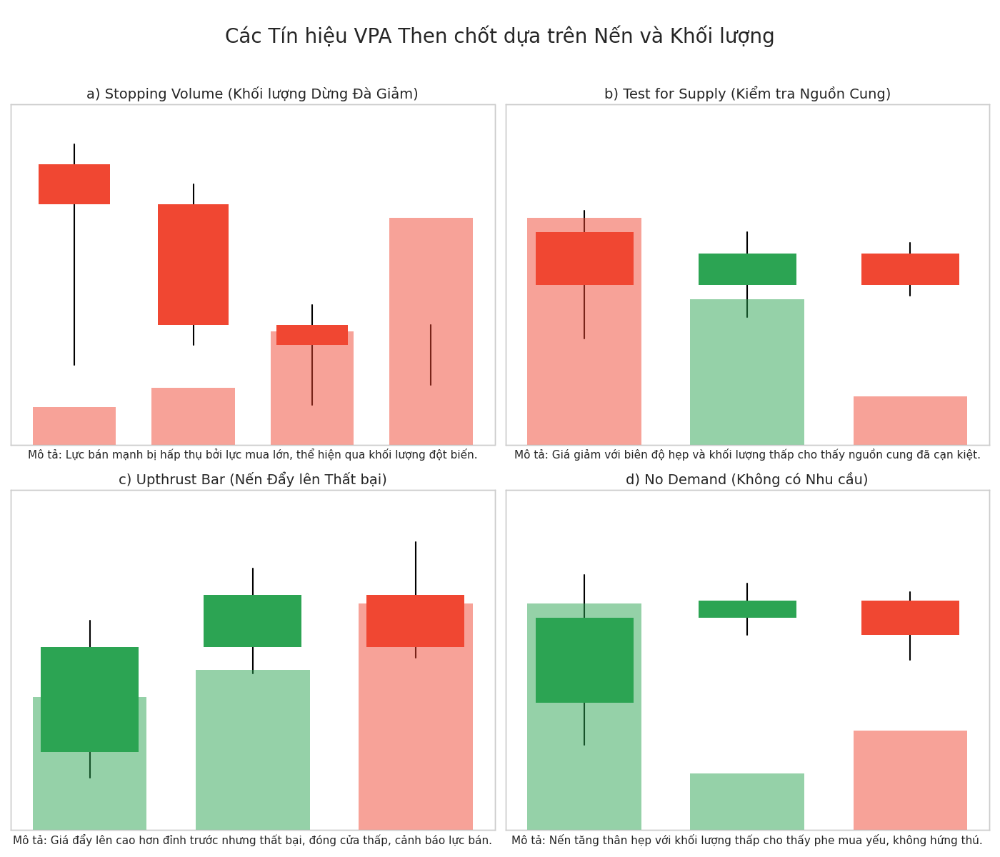
-   **Bảng Tổng hợp các Tín hiệu VPA chính theo Anna Coulling**
    Bảng này là một công cụ tham khảo nhanh chóng để xác định các mẫu hình nến và khối lượng cụ thể cùng với ý nghĩa tăng hoặc giảm giá của chúng. Đây là một công cụ cơ bản cho việc quét VPA hàng ngày. Mặc dù các giai đoạn Wyckoff cung cấp bối cảnh rộng lớn, những tín hiệu VPA này là các hiện tượng cụ thể, có thể quan sát được, giúp xác nhận hoặc bác bỏ câu chuyện thị trường đang diễn ra. Bảng này giúp các nhà giao dịch nhanh chóng nhận ra các tín hiệu này và hiểu được ý nghĩa tức thời của chúng. Ví dụ, việc nhìn thấy một thanh "**No Demand**" sau một đợt tăng giá hướng tới mức kháng cự trong Giai đoạn C Phân phối Wyckoff tiềm năng là một tín hiệu hội tụ mạnh mẽ.

| Tên tín hiệu VPA (Anh - Việt)                                          | Mô tả nến và khối lượng đặc trưng                                                                                        | Ý nghĩa (Sức mạnh/Yếu kém) & Hàm ý cho nhà giao dịch                                                                                         | Vị trí thường xuất hiện                                  |
| ----------------------------------------------------------------------- | ------------------------------------------------------------------------------------------------------------------------ | -------------------------------------------------------------------------------------------------------------------------------------------- | -------------------------------------------------------- |
| **Stopping Volume (Khối lượng Dừng Đà Giảm)**                           | Nến giảm/thân nhỏ, đóng cửa nửa trên/gần đỉnh, KLGD RẤT LỚN.                                                              | Sức mạnh tiềm ẩn. Lực bán mạnh bị hấp thụ. Dấu hiệu xu hướng giảm sắp kết thúc. Chờ xác nhận.                                              | Cuối xu hướng giảm.                                     |
| **Test for Supply (Kiểm tra Nguồn Cung)**                                | Nến giảm, spread hẹp, KLGD THẤP.                                                                                         | Sức mạnh. Nguồn cung cạn kiệt ở giá thấp. Nếu test thành công (giá tăng sau đó), là tín hiệu mua.                                           | Sau đợt giảm, trong vùng tích lũy.                      |
| **No Supply (Không có Nguồn Cung)**                                      | Nến giảm, spread hẹp, KLGD THẤP hơn 2 nến trước.                                                                        | Sức mạnh. Lực bán yếu ớt. Cần xác nhận bằng nến tăng mạnh sau đó.                                                                           | Trong vùng tích lũy, hoặc trong xu hướng tăng yếu.      |
| **Reverse Upthrust (Đẩy lên Ngược)**                                    | Giá cố giảm (tạo đáy mới trong ngày) rồi bị đẩy ngược lên đóng cửa gần đỉnh, KLGD có thể tăng.                              | Sức mạnh. Lực mua mạnh từ chối giá thấp.                                                                                                    | Xu hướng giảm, vùng tích lũy.                            |
| **Effort to Rise (Nỗ lực Tăng giá)**                                     | Nến tăng, spread rộng, đóng cửa ở đỉnh, KLGD CAO.                                                                        | Sức mạnh. Cam kết mạnh từ bên mua. Xác nhận xu hướng tăng.                                                                                   | Bắt đầu/trong xu hướng tăng, phá vỡ kháng cự.            |
| **Topping Out Volume / Potential Buying Climax (Khối lượng Tạo Đỉnh / Cao trào Mua Tiềm năng)** | Nến tăng, spread rộng, KLGD CỰC LỚN, giá không duy trì được đà tăng hoặc đóng cửa thấp hơn nhiều so với đỉnh.            | Yếu kém. Lực mua lớn bị đáp ứng bởi lực bán lớn từ CM. Dấu hiệu xu hướng tăng sắp kết thúc.                                                 | Cuối xu hướng tăng.                                     |
| **Upthrust Bar / Pseudo Upthrust (Nến Đẩy giá lên Thất bại / Đẩy lên Giả)** | Giá đẩy lên cao hơn đỉnh trước nhưng thất bại, đóng cửa gần đáy/nửa dưới. KLGD Upthrust: cao/TB. KLGD Pseudo Upthrust: thấp. | Yếu kém. CM bán ở giá cao (Upthrust). Thiếu cầu ở giá cao (Pseudo Upthrust). Bẫy tăng giá.                                                  | Xu hướng tăng, vùng phân phối, gần kháng cự.            |
| **No Demand (Không có Nhu cầu)**                                         | Nến tăng, spread hẹp, KLGD THẤP.                                                                                         | Yếu kém. Thiếu sự quan tâm từ bên mua để đẩy giá cao hơn. Xu hướng tăng yếu đi.                                                             | Sau xu hướng tăng dài, tại vùng kháng cự.                |
| **Effort to Fall (Nỗ lực Giảm giá)**                                     | Nến giảm, spread rộng, đóng cửa ở đáy, KLGD CAO.                                                                         | Yếu kém. Cam kết mạnh từ bên bán. Xác nhận xu hướng giảm.                                                                                    | Bắt đầu/trong xu hướng giảm, phá vỡ hỗ trợ.              |
| *(Nguồn: Tổng hợp từ )*                                                 |                                                                                                                          |                                                                                                                                              |                                                          |

---

## Phần 3: Thực chiến VPA & Wyckoff: Phân tích VN-Index và Cổ phiếu Trụ cột với Dữ liệu 2025 📈

Phần này sẽ áp dụng các kiến thức lý thuyết đã trình bày vào phân tích thực tế dữ liệu giá và khối lượng của VN-Index và một số cổ phiếu tiêu biểu trong giai đoạn giả định từ 05/05/2025 đến 13/06/2025. Mục tiêu là minh họa cách một nhà phân tích VPA/Wyckoff "đọc" thị trường và đưa ra những nhận định dựa trên bằng chứng cụ thể.

### **3.1. Bối cảnh Thị trường Giả định (Tháng 5 - Tháng 6 năm 2025)**

Dữ liệu cung cấp cho VN-Index trong giai đoạn từ ngày 05/05/2025 đến 13/06/2025 cho thấy một xu hướng tăng tổng thể, với chỉ số bắt đầu ở mức 1226.3 điểm và kết thúc ở 1315.49 điểm. Tuy nhiên, trong suốt giai đoạn này, có những biến động tăng giảm đáng kể, đi kèm với những thay đổi về khối lượng giao dịch, tạo ra nhiều cơ hội để áp dụng phân tích VPA và Wyckoff. Phần phân tích dưới đây sẽ xem xét các diễn biến này như thể chúng đang diễn ra trong thời gian thực, nhằm mục đích huấn luyện kỹ năng nhận diện tín hiệu và đưa ra phán đoán.
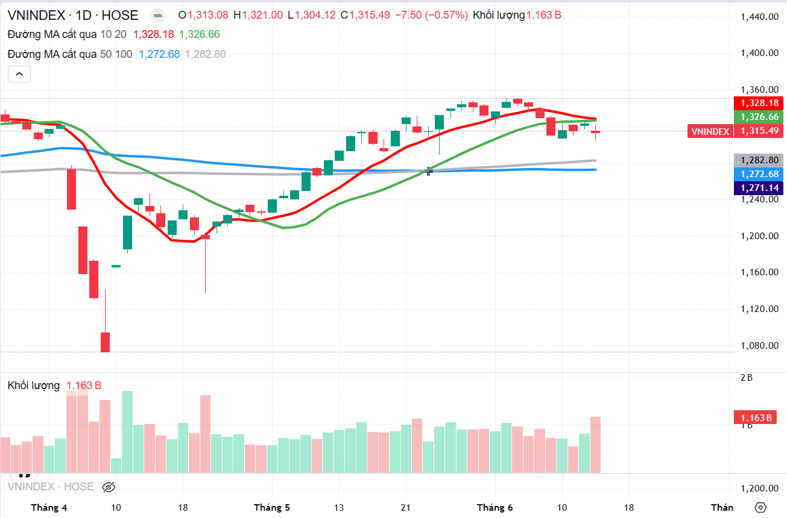
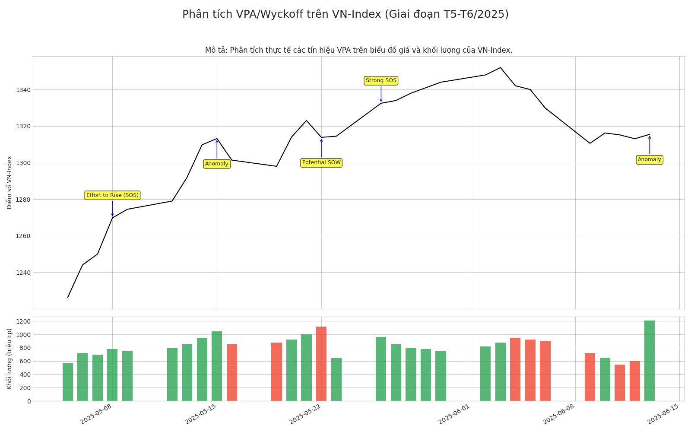

### **3.2. Nghiên cứu Tình huống Chuyên sâu: VN-Index (Giai đoạn 05/05/2025 – 13/06/2025)**

Phân tích chi tiết từng ngày hoặc cụm nến quan trọng sẽ giúp làm rõ cách các nguyên lý VPA/Wyckoff được áp dụng.

-   **Ngày 2025-05-08:** VN-Index tăng mạnh từ 1250.37 điểm lên 1269.8 điểm. Cây nến có biên độ (spread) rộng, giá đóng cửa gần mức cao nhất trong phiên. Khối lượng giao dịch (volume) đạt 780.78 triệu đơn vị, tăng đáng kể so với các phiên trước đó (05/05: 562.82 triệu; 05/06: 723.83 triệu; 05/07: 696.86 triệu).
    -   **Phân tích VPA/Wyckoff:** Đây là một tín hiệu **Effort to Rise (Nỗ lực Tăng giá)** rõ ràng. Sự gia tăng đồng thuận của cả giá (tăng mạnh, biên độ rộng, đóng cửa cao) và khối lượng (tăng mạnh) cho thấy có một sự cam kết mạnh mẽ từ phía bên mua. Nếu diễn biến này xảy ra sau một giai đoạn tích lũy hoặc phá vỡ một vùng kháng cự quan trọng, nó có thể được xem là một **Sign of Strength (SOS – Dấu hiệu Sức mạnh)**.
    -   Việc giá tăng mạnh đi kèm với khối lượng lớn cho thấy "**dòng tiền thông minh**" có khả năng đang tham gia, và xu hướng tăng này có nền tảng vững chắc hơn là một cú tăng giá nhất thời trên khối lượng thấp. Điều này báo hiệu khả năng tiếp diễn xu hướng tăng trong các phiên tới.

-   **Ngày 2025-05-15:** VN-Index tăng nhẹ từ 1309.73 điểm lên 1313.2 điểm. Tuy nhiên, biên độ nến hẹp hơn nhiều so với các phiên tăng mạnh trước đó (ví dụ phiên 2025-05-14 tăng từ 1293.43 lên 1309.73 điểm). Điều đáng chú ý là khối lượng giao dịch RẤT CAO, đạt 1,048.49 triệu đơn vị, mức cao nhất trong nhiều tuần. Cây nến có cả bóng trên và bóng dưới, giá đóng cửa gần mức giá mở cửa, tạo thành một dạng nến con xoay (spinning top) hoặc Doji.
    -   **Phân tích VPA/Wyckoff:** Đây là một **sự bất thường (Anomaly)** điển hình. "Nỗ lực" (khối lượng rất cao) không tạo ra một "kết quả" (biến động giá tăng mạnh) tương xứng. Điều này cho thấy một cuộc chiến quyết liệt giữa phe mua và phe bán. Khối lượng lớn có thể là dấu hiệu của áp lực bán tiềm ẩn đang hấp thụ lực mua (**Absorption**), hoặc thị trường đang gặp khó khăn cực lớn để vượt qua một vùng cản quan trọng. Nếu sau đó giá giảm, đây có thể là một dạng **Topping Out Volume (Khối lượng Tạo Đỉnh)** sớm hoặc một **Buying Climax (Cao trào Mua)** nếu nó xuất hiện ở cuối một xu hướng tăng mạnh.
    -   Khối lượng cực lớn trên một cây nến có biên độ hẹp hoặc không tăng tương xứng là một cảnh báo quan trọng. Nó cho thấy một lượng lớn cổ phiếu đang được trao tay. Nếu phe mua thực sự mạnh, tại sao giá không tăng vọt trên khối lượng lớn như vậy? Điều này ngụ ý rằng phe bán cũng rất mạnh và đang tích cực bán ra, hấp thụ hết lực mua. Đây có thể là dấu hiệu "**Composite Man**" bắt đầu quá trình phân phối. Kết quả của trận chiến này, thể hiện qua hướng đi của giá trong các phiên tiếp theo, sẽ rất quan trọng.

-   **Ngày 2025-05-16:** VN-Index giảm từ 1313.2 điểm xuống 1301.39 điểm. Biên độ nến giảm rộng hơn so với nến ngày hôm trước, và giá đóng cửa gần mức thấp nhất phiên. Khối lượng giao dịch vẫn ở mức cao (850.78 triệu đơn vị), dù thấp hơn phiên kỷ lục 2025-05-15.
    -   **Phân tích VPA/Wyckoff:** Đây là một tín hiệu **Effort to Fall (Nỗ lực Giảm giá)**, xuất hiện ngay sau tín hiệu bất thường của ngày hôm trước. Nó xác nhận rằng áp lực bán đã thắng thế trong ngắn hạn.
    -   Sự tiếp nối của hành động giá giảm với khối lượng vẫn ở mức cao (so với mức trung bình) sau một ngày có dấu hiệu phân phối/hấp thụ là một tín hiệu tiêu cực. Nó cho thấy phe bán đang kiểm soát thị trường. Nếu ngày 2025-05-15 là một trận chiến, thì ngày 2025-05-16 cho thấy phe bán đã giành ưu thế, ít nhất là tạm thời.

-   **Ngày 2025-05-22:** VN-Index giảm mạnh từ 1323.05 điểm xuống 1313.84 điểm. Biên độ nến rộng, giá đóng cửa gần mức thấp nhất phiên. Khối lượng giao dịch RẤT CAO, đạt 1,119.98 triệu đơn vị, cao hơn cả phiên tăng mạnh trước đó (2025-05-21, khối lượng 1,000.99 triệu đơn vị) và là một trong những mức cao nhất trong giai đoạn phân tích.
    -   **Phân tích VPA/Wyckoff:** Đây là một **Effort to Fall** rất mạnh mẽ. Nếu phiên này phá vỡ một mức hỗ trợ quan trọng hoặc đánh dấu sự thay đổi rõ rệt trong hành vi thị trường sau một đợt tăng, nó có thể được coi là một **Sign of Weakness (SOW – Dấu hiệu Yếu kém)**.
    -   Một cây nến giảm mạnh với biên độ rộng, đóng cửa gần đáy trên khối lượng cực lớn sau một giai đoạn tăng giá là một tín hiệu cảnh báo rất mạnh mẽ về khả năng đảo chiều hoặc bắt đầu một đợt điều chỉnh sâu. "**Dòng tiền thông minh**" có thể đang tích cực bán ra. Việc giá bị bán mạnh xuống từ mức cao nhất trong phiên (1331.93 điểm) để đóng cửa ở 1313.84 điểm trên khối lượng kỷ lục cho thấy một lượng cung khổng lồ đã được tung ra thị trường, điều này khó có thể là hành động của nhà đầu tư nhỏ lẻ.

-   **Ngày 2025-05-23:** VN-Index chỉ tăng nhẹ từ 1313.84 điểm lên 1314.46 điểm. Biên độ nến rất hẹp, và khối lượng giao dịch THẤP (642.50 triệu đơn vị) so với phiên giảm mạnh ngày hôm trước.
    -   **Phân tích VPA/Wyckoff:** Đây là một tín hiệu **No Demand (Không có Nhu cầu)** điển hình, xuất hiện sau một phiên giảm mạnh. Nó cho thấy phe mua rất yếu ớt, không có khả năng hoặc không sẵn sàng đẩy giá lên một cách đáng kể.
    -   Sự thiếu vắng lực cầu sau một đợt bán tháo mạnh là một dấu hiệu xấu, thường báo hiệu giá sẽ tiếp tục giảm hoặc đi ngang tích lũy thêm trước khi có thể tăng trở lại. Nếu phe mua thực sự mạnh và tin rằng đợt giảm hôm trước là cơ hội, họ sẽ mua vào mạnh mẽ, đẩy giá tăng kèm khối lượng lớn. Việc giá chỉ tăng nhẹ trên khối lượng thấp cho thấy sự thờ ơ của phe mua và phe bán vẫn đang kiểm soát tình hình.

-   **Ngày 2025-05-26:** VN-Index tăng RẤT MẠNH từ 1314.46 điểm lên 1332.51 điểm. Biên độ nến cực rộng, giá đóng cửa tại mức cao nhất phiên (cho thấy không có áp lực bán đáng kể ở cuối phiên). Khối lượng giao dịch CAO (961.30 triệu đơn vị), tăng mạnh so với phiên "**No Demand**" trước đó.
    -   **Phân tích VPA/Wyckoff:** Đây là một **Effort to Rise** mạnh mẽ, có thể là một **Sign of Strength (SOS)** hoặc một sự phục hồi mạnh sau cú rũ bỏ (nếu phiên 2025-05-22 được xem là một dạng **shakeout**). Tín hiệu này phủ nhận hoàn toàn tín hiệu "**No Demand**" của phiên 2025-05-23.
    -   Một cú tăng mạnh mẽ như vậy với khối lượng lớn cho thấy một lực cầu mạnh đã quay trở lại thị trường, có khả năng làm thay đổi cục diện ngắn hạn. Cần xem xét liệu đây có phải là một cú hồi phục trong một xu hướng giảm lớn hơn (nếu phiên 2025-05-22 là một SOW thực sự) hay là sự tiếp diễn của xu hướng tăng sau một đợt điều chỉnh. Thị trường luôn vận động, và tín hiệu "**No Demand**" ngày 2025-05-23 gợi ý khả năng giảm tiếp. Tuy nhiên, phiên 2025-05-26 với sức mạnh áp đảo của phe mua cho thấy một sự thay đổi. Đây có thể là "**Composite Man**" can thiệp để hỗ trợ giá, hoặc một dòng tiền mới mạnh mẽ nhập cuộc.

-   **Ngày 2025-06-06:** VN-Index giảm từ 1342.09 điểm xuống 1329.89 điểm. Biên độ nến rộng, khối lượng giao dịch CAO (901.23 triệu đơn vị).
    -   **Phân tích VPA/Wyckoff:** Đây là một tín hiệu **Effort to Fall**. Sau một giai đoạn tăng giá, một phiên giảm mạnh với khối lượng cao cho thấy áp lực bán đang gia tăng.

-   **Ngày 2025-06-09:** VN-Index tiếp tục giảm từ 1329.89 điểm xuống 1310.57 điểm. Biên độ nến vẫn rộng, và khối lượng giao dịch vẫn ở mức khá (718.70 triệu đơn vị).
    -   **Phân tích VPA/Wyckoff:** Tiếp tục là **Effort to Fall** hoặc có thể là một phần của **Sign of Weakness**. Nếu có một mức hỗ trợ quan trọng bị phá vỡ trong phiên này hoặc các phiên kế tiếp, đây sẽ là tín hiệu xác nhận cho xu hướng giảm.

-   **Ngày 2025-06-11:** VN-Index giảm nhẹ từ 1316.23 điểm xuống 1315.2 điểm. Biên độ nến rất hẹp, và khối lượng giao dịch THẤP (546.07 triệu đơn vị).
    -   **Phân tích VPA/Wyckoff:** Tín hiệu này có thể được diễn giải theo nhiều cách tùy thuộc vào bối cảnh. Nếu trước đó có dấu hiệu dừng đà giảm (ví dụ một cây nến rút chân với khối lượng tăng), đây có thể là một tín hiệu **No Supply (Không có Nguồn Cung)**, cho thấy lực bán đã cạn kiệt ở mức giá này. Nếu sau đó giá tăng, đây là một tín hiệu tốt. Tuy nhiên, nếu không có dấu hiệu hỗ trợ trước đó, nó cũng có thể chỉ đơn giản là thị trường tạm nghỉ trước khi có diễn biến mới, hoặc phe bán tạm thời không muốn bán ở giá thấp hơn nữa nhưng phe mua cũng chưa mạnh.

-   **Ngày 2025-06-13:** VN-Index tăng nhẹ từ 1313.08 điểm (giá mở cửa phiên này, không phải giá đóng cửa phiên trước) lên 1315.49 điểm. Biên độ nến thực (từ mở cửa đến đóng cửa) hẹp. Tuy nhiên, khối lượng giao dịch RẤT CAO, đạt 1,207.44 triệu đơn vị, mức cao nhất trong toàn bộ giai đoạn phân tích. Cây nến có bóng trên, cho thấy giá đã cố gắng tăng cao hơn trong phiên nhưng bị đẩy xuống.
    -   **Phân tích VPA/Wyckoff:** Đây lại là một **sự bất thường (Anomaly)** tương tự như ngày 2025-05-15. Khối lượng cực lớn nhưng giá chỉ tăng nhẹ và không giữ được mức cao nhất trong phiên. Đây là dấu hiệu của áp lực bán mạnh đang đối đầu với lực mua (**Absorption/Distribution**). Cần theo dõi chặt chẽ các phiên tiếp theo để xác định bên nào sẽ thắng thế.
    -   Việc xuất hiện liên tiếp các phiên có khối lượng cực lớn nhưng giá không di chuyển tương xứng (như các ngày 2025-05-15, 2025-05-22 (giảm mạnh), và 2025-06-13) trong một khoảng thời gian tương đối ngắn (khoảng một tháng) là một dấu hiệu rất quan trọng. Nó cho thấy thị trường đang ở một giai đoạn giao dịch cực kỳ sôi động, nơi "**dòng tiền thông minh**" có thể đang tích cực hành động – hoặc là tích lũy mạnh mẽ hoặc là phân phối một cách quyết liệt. Các phiên có khối lượng đột biến thường là dấu chân của "**Composite Man**". Nếu giá tăng mạnh trên khối lượng lớn, đó là dấu hiệu CM mua vào. Nếu giá không tăng tương xứng hoặc giảm trên khối lượng lớn, đó là dấu hiệu CM bán ra hoặc có sự đối đầu quyết liệt. Sự lặp lại của các tín hiệu này cho thấy một "nguyên nhân" (theo **quy luật Nguyên nhân và Kết quả của Wyckoff**) đang được xây dựng, có thể dẫn đến một "kết quả" (xu hướng giá) đáng kể sau đó.

-   **Xác định các vùng Hỗ trợ/Kháng cự tiềm năng:**
    -   Vùng quanh 1240-1250 điểm có thể đóng vai trò hỗ trợ sau khi bị phá vỡ vào ngày 2025-05-08.
    -   Vùng đỉnh ngắn hạn quanh 1330-1350 điểm (tạo bởi các ngày 2025-05-21, 2025-05-22, 2025-05-26, 2025-06-03, 2025-06-04) là vùng kháng cự cần theo dõi.

-   **Bảng: Nhật ký Phân tích VPA/Wyckoff cho VN-Index (05/05/2025 – 13/06/2025)**
    Bảng này cung cấp một bản ghi chi tiết, từng bước về cách một nhà phân tích VPA/Wyckoff "đọc" thị trường hàng ngày. Nó biến lý thuyết thành hành động quan sát và diễn giải cụ thể, giúp người đọc học cách tự làm điều tương tự. Đây là một công cụ học tập thực hành vô giá, mô phỏng nhật ký phân tích, ghi lại các quan sát chính và suy luận từ dữ liệu giá/khối lượng mỗi ngày, liên kết chúng với các khái niệm VPA/Wyckoff.

| Ngày       | Giá Đóng cửa | % Thay đổi | Khối lượng (tr) | Spread Nến | Tín hiệu VPA/Wyckoff quan sát được                     | Diễn giải và Hàm ý                                                                                                       |
| ---------- | ------------ | ----------- | --------------- | ---------- | -------------------------------------------------------- | ------------------------------------------------------------------------------------------------------------------------- |
| 2025-05-08 | 1269.8       | +1.55%      | 780.78          | Rộng       | **Effort to Rise / SOS**                                 | Lực mua mạnh, xác nhận bởi KL tăng, khả năng tiếp diễn xu hướng tăng.                                                      |
| 2025-05-15 | 1313.2       | +0.27%      | 1048.49         | Hẹp        | **Anomaly (KL rất cao, giá tăng ít), Potential Topping Out Volume** | Nỗ lực lớn không tạo kết quả tương xứng, dấu hiệu áp lực bán tiềm ẩn hoặc kháng cự mạnh. Cần theo dõi các phiên sau.      |
| 2025-05-16 | 1301.39      | -0.90%      | 850.78          | Rộng       | **Effort to Fall**                                       | Xác nhận áp lực bán thắng thế sau tín hiệu bất thường hôm trước.                                                           |
| 2025-05-22 | 1313.84      | -0.69%      | 1119.98         | Rộng       | **Effort to Fall rất mạnh / Potential SOW**               | Lực bán rất mạnh, KL cực lớn, cảnh báo khả năng đảo chiều hoặc điều chỉnh sâu.                                             |
| 2025-05-23 | 1314.46      | +0.05%      | 642.50          | Rất hẹp    | **No Demand**                                            | Thiếu lực cầu sau phiên giảm mạnh, phe mua yếu ớt, khả năng giảm tiếp.                                                     |
| 2025-05-26 | 1332.51      | +1.37%      | 961.30          | Rất rộng   | **Effort to Rise mạnh / SOS**                             | Lực cầu mạnh quay trở lại, phủ nhận No Demand trước đó. Có thể thay đổi cục diện ngắn hạn.                                  |
| 2025-06-06 | 1329.89      | -0.91%      | 901.23          | Rộng       | **Effort to Fall**                                       | Áp lực bán gia tăng sau một giai đoạn tăng.                                                                               |
| 2025-06-09 | 1310.57      | -1.45%      | 718.70          | Rộng       | **Effort to Fall / SOW (nếu phá vỡ hỗ trợ)**              | Tiếp tục xu hướng giảm, cần xác nhận phá vỡ hỗ trợ.                                                                        |
| 2025-06-11 | 1315.2       | -0.08%      | 546.07          | Rất hẹp    | **Potential No Supply / Tạm nghỉ**                       | Lực bán có thể cạn kiệt ở mức giá này nếu có xác nhận tăng sau đó, hoặc thị trường đang chờ diễn biến mới.                  |
| 2025-06-13 | 1315.49      | +0.18%      | 1207.44         | Hẹp        | **Anomaly (KL rất cao, giá tăng ít), Potential Absorption/Distribution** | KL cực lớn nhưng giá tăng không tương xứng, bóng nến trên. Dấu hiệu đối đầu mạnh giữa mua và bán. Cần theo dõi chặt chẽ các phiên tiếp theo. |
| *(Nguồn dữ liệu: )* |              |             |                 |            |                                                          |                                                                                                                           |

### **3.3. Phân tích Chuyên sâu các Cổ phiếu Tiêu biểu**

Việc áp dụng VPA/Wyckoff trên các cổ phiếu riêng lẻ giúp nhận diện các đặc điểm và "tính cách" riêng của từng mã, đồng thời so sánh sức mạnh tương đối của chúng so với thị trường chung.
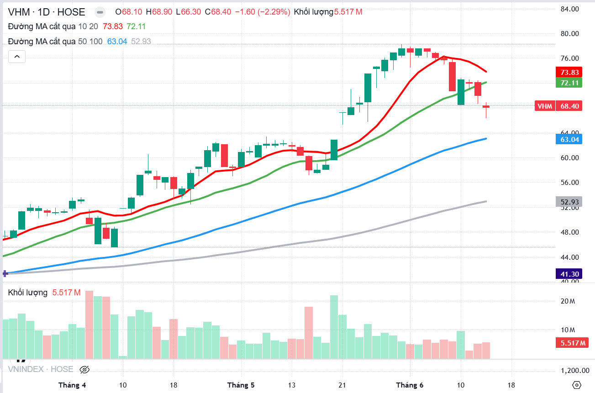
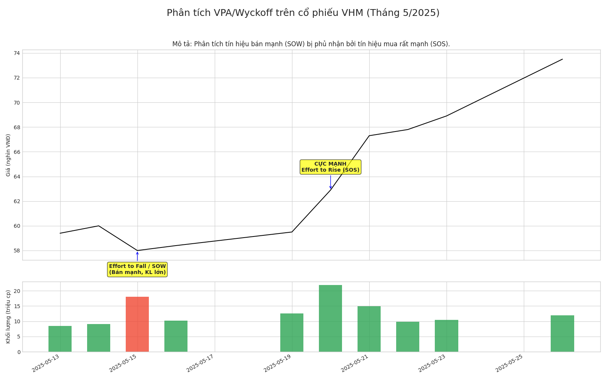
-   **Phân tích VHM (Vinhomes JSC):**
    -   **Ngày 2025-05-15:** VHM giảm mạnh từ giá mở cửa 60.2 xuống giá đóng cửa 58.0. Cây nến có biên độ rộng, đóng cửa gần mức thấp nhất phiên. Khối lượng giao dịch RẤT CAO, đạt 17.97 triệu cổ phiếu, là mức cao nhất trong nhiều phiên trước đó.
        -   **Phân tích VPA/Wyckoff:** Đây là một tín hiệu **Effort to Fall (Nỗ lực Giảm giá)** rất mạnh mẽ. Nếu cổ phiếu đang ở gần một vùng đỉnh hoặc phá vỡ một mức hỗ trợ quan trọng, tín hiệu này có thể được coi là một **Sign of Weakness (SOW – Dấu hiệu Yếu kém)**.
        -   Một phiên giảm mạnh với khối lượng đột biến sau một giai đoạn giá đi ngang hoặc tăng nhẹ là một tín hiệu cảnh báo mạnh về khả năng đảo chiều hoặc bắt đầu một xu hướng giảm. Khối lượng lớn cho thấy sự đồng thuận của phe bán hoặc sự thoát hàng của "**dòng tiền thông minh**". Việc đóng cửa gần mức thấp nhất cho thấy phe bán hoàn toàn kiểm soát phiên giao dịch.
    -   **Ngày 2025-05-20:** VHM tăng VỌT từ giá mở cửa 59.6 lên giá đóng cửa 62.9. Biên độ nến cực rộng, giá đóng cửa tại mức cao nhất phiên. Khối lượng giao dịch CỰC KỲ CAO, đạt 21.92 triệu cổ phiếu, là mức cao nhất trong toàn bộ giai đoạn dữ liệu được cung cấp cho VHM.
        -   **Phân tích VPA/Wyckoff:** Đây là một **Effort to Rise** cực mạnh, một **Sign of Strength (SOS)** rõ ràng. Tín hiệu này hoàn toàn đảo ngược và phủ nhận tín hiệu yếu kém của ngày 2025-05-15.
        -   Một cú tăng giá bùng nổ với khối lượng kỷ lục cho thấy một lực cầu cực lớn đã nhập cuộc, có khả năng đến từ "**dòng tiền thông minh**". Đây là một tín hiệu rất tích cực. Sự thay đổi đột ngột từ tín hiệu bán mạnh sang tín hiệu mua cực mạnh cho thấy thị trường có thể rất biến động hoặc "**Composite Man**" đang chủ động thay đổi cục diện. Phiên này, khi xem xét cùng với phiên giảm mạnh ngày 05-15, có thể là một dạng "**shakeout**" (rũ bỏ) được theo sau bởi một SOS mạnh mẽ, một kịch bản rất điển hình trong các giai đoạn tích lũy hoặc tái tích lũy.
    -   **Ngày 2025-05-21:** VHM tiếp tục tăng mạnh, mở cửa tạo khoảng trống tăng giá (gap up) và đóng cửa ở 67.3. Khối lượng giao dịch vẫn rất cao (14.98 triệu cổ phiếu).
        -   **Phân tích VPA/Wyckoff:** Tiếp diễn **Sign of Strength**. Sự tăng giá mạnh mẽ kèm khối lượng lớn và gap up cho thấy sự quyết tâm của phe mua.
    -   **Ngày 2025-05-26:** VHM lại có một phiên tăng RẤT MẠNH từ giá mở cửa 69.0 lên giá đóng cửa 73.5. Biên độ nến rộng, giá đóng cửa ở mức cao nhất phiên. Khối lượng giao dịch CAO (11.9 triệu cổ phiếu).
        -   **Phân tích VPA/Wyckoff:** Tiếp tục là **Effort to Rise / Sign of Strength**.
    -   **Tổng quan VHM:** Cổ phiếu VHM trong giai đoạn này cho thấy những biến động giá rất mạnh mẽ, với các phiên có khối lượng đột biến ở cả chiều tăng và giảm. Các tín hiệu SOS rất rõ ràng và mạnh mẽ, thường xuất hiện sau các đợt giảm giá hoặc điều chỉnh. Điều này cho thấy VHM có thể đang trong một giai đoạn tái tích lũy mạnh mẽ hoặc bắt đầu một chu kỳ tăng giá mới với sự tham gia tích cực của dòng tiền lớn. Sự xuất hiện của các phiên SOS với khối lượng cực lớn sau các đợt điều chỉnh/giảm giá là đặc điểm của cổ phiếu mạnh đang được "**smart money**" thu gom. Các đợt bán mạnh trước đó (như ngày 05-15) có thể là những cú "**rũ bỏ**" (**shakeout**) để loại bỏ các nhà đầu tư yếu tay trước khi giá tăng cao hơn.
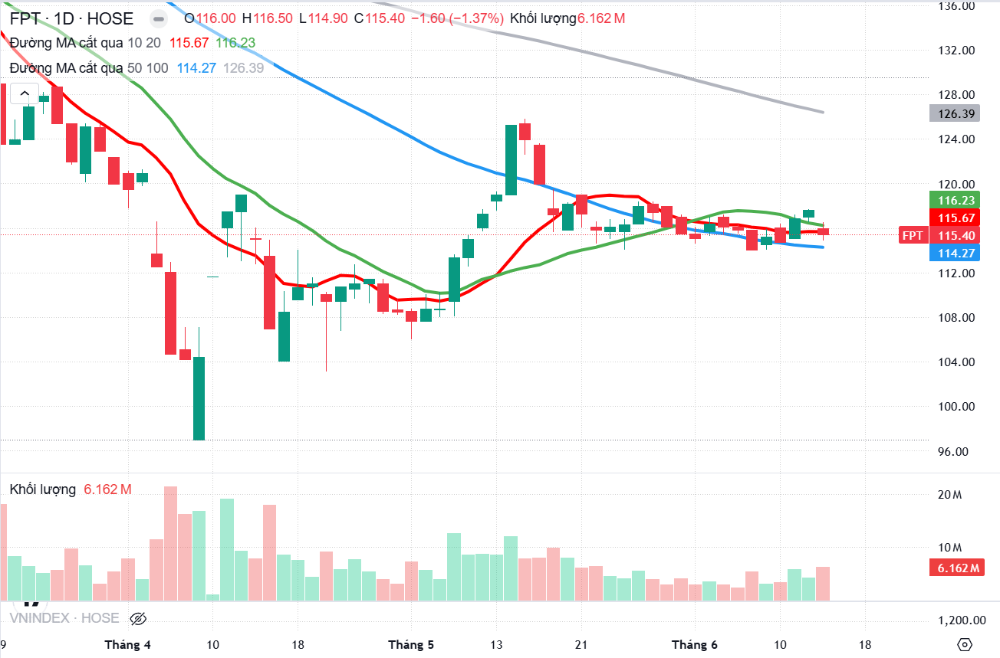
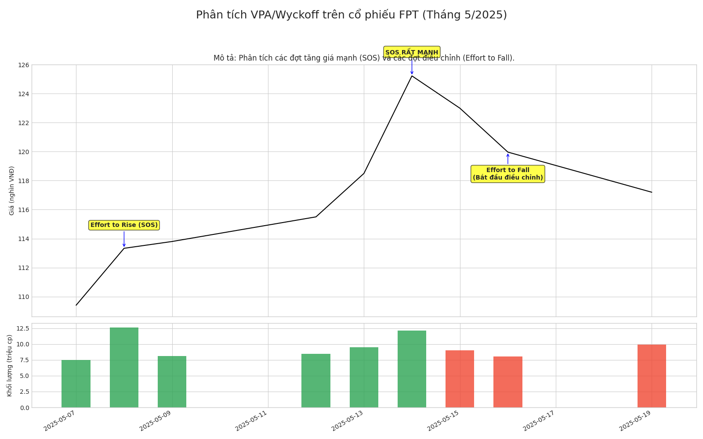
-   **Phân tích FPT (FPT Corporation):**
    -   **Ngày 2025-05-08:** FPT tăng mạnh từ giá mở cửa 109.46 lên giá đóng cửa 113.33. Biên độ nến rộng, khối lượng giao dịch CAO (12.66 triệu cổ phiếu), đột biến so với các phiên trước đó.
        -   **Phân tích VPA/Wyckoff:** Đây là một tín hiệu **Effort to Rise / Sign of Strength (SOS)**.
    -   **Ngày 2025-05-14:** FPT tăng VỌT từ giá mở cửa 118.98 lên giá đóng cửa 125.23 (cũng là mức cao nhất phiên). Biên độ nến rất rộng, khối lượng giao dịch RẤT CAO (12.11 triệu cổ phiếu).
        -   **Phân tích VPA/Wyckoff:** Một **Effort to Rise / Sign of Strength (SOS)** rất mạnh mẽ, xác nhận xu hướng tăng.
    -   **Ngày 2025-05-16:** FPT giảm mạnh từ giá mở cửa 123.44 xuống giá đóng cửa 119.97. Biên độ nến rộng, khối lượng giao dịch CAO (8.03 triệu cổ phiếu).
        -   **Phân tích VPA/Wyckoff:** Đây là một tín hiệu **Effort to Fall**. Sau một chuỗi tăng giá mạnh, phiên giảm này với khối lượng cao cho thấy có áp lực chốt lời hoặc bắt đầu một đợt điều chỉnh.
    -   **Ngày 2025-05-19:** FPT tiếp tục giảm, đóng cửa ở 117.2. Khối lượng giao dịch vẫn ở mức cao (9.94 triệu cổ phiếu).
        -   **Phân tích VPA/Wyckoff:** Tiếp tục là **Effort to Fall**, xác nhận đợt điều chỉnh đang diễn ra.
    -   **Tổng quan FPT:** Cổ phiếu FPT cho thấy các đợt tăng giá mạnh mẽ (SOS) được xác nhận bởi khối lượng lớn, theo sau là các đợt điều chỉnh cũng với khối lượng đáng kể. Điều này cho thấy một cổ phiếu có xu hướng rõ ràng và thu hút dòng tiền. Các đợt điều chỉnh là bình thường trong một xu hướng tăng. Nhà đầu tư theo VPA sẽ theo dõi các đợt điều chỉnh này để tìm kiếm các tín hiệu như "**Test for Supply**" (giá kiểm tra lại vùng hỗ trợ với khối lượng thấp) hoặc "**No Supply**" được theo sau bởi một cây nến tăng mạnh trở lại, đó có thể là các điểm vào lệnh tiềm năng để mua theo xu hướng.

-   **So sánh/Đối chiếu hành vi của các cổ phiếu với VN-Index:**
    Trong giai đoạn phân tích, cả VHM và FPT đều cho thấy những tín hiệu sức mạnh (SOS) rõ ràng, thường đi kèm với khối lượng đột biến, tương tự như một số phiên tăng mạnh của VN-Index (ví dụ ngày 2025-05-08, 2025-05-26). Tuy nhiên, mức độ biến động và cường độ của các tín hiệu trên VHM có vẻ mạnh mẽ hơn FPT, với các phiên có khối lượng cực lớn và những cú đảo chiều ngoạn mục. Điều này có thể cho thấy VHM đang thu hút sự chú ý đặc biệt của "**dòng tiền thông minh**" trong giai đoạn này. Việc VN-Index cũng có những phiên tăng mạnh với khối lượng lớn cho thấy có sự đồng thuận nhất định trên thị trường, nhưng hành vi của từng cổ phiếu trụ cột vẫn có những nét riêng. Ví dụ, phiên SOS ngày 2025-05-20 của VHM với khối lượng kỷ lục là một tín hiệu rất nổi bật, có thể đã đóng góp đáng kể vào đà tăng của chỉ số chung trong những ngày sau đó.

-   **Bảng: Tổng hợp Tín hiệu VPA/Wyckoff trên các Cổ phiếu Chọn lọc (05/05/2025 – 13/06/2025)**
    Bảng này giúp người đọc thấy cách áp dụng VPA/Wyckoff trên các cổ phiếu riêng lẻ với các đặc điểm khác nhau, rèn luyện kỹ năng nhận diện tín hiệu và so sánh sức mạnh tương đối. Mỗi cổ phiếu có "tính cách" riêng, và việc phân tích VPA/Wyckoff trên nhiều mã giúp nhà đầu tư hiểu được sự đa dạng của các biểu hiện tín hiệu và cách "**Composite Man**" có thể hoạt động khác nhau.

| Mã CK | Ngày       | Tín hiệu VPA/Wyckoff nổi bật                               | Đặc điểm Giá                                           | Đặc điểm Khối lượng (tr) | Diễn giải và Tiềm năng Giao dịch                                                                    |
| ----- | ---------- | ----------------------------------------------------------- | ------------------------------------------------------ | ------------------------- | -------------------------------------------------------------------------------------------------- |
| VHM   | 2025-05-15 | **Effort to Fall / SOW**                                    | Giảm mạnh, spread rộng, đóng cửa gần đáy               | 17.97 (Rất cao)           | Áp lực bán mạnh, cảnh báo khả năng đảo chiều/giảm tiếp.                                            |
| VHM   | 2025-05-20 | **Effort to Rise CỰC MẠNH / SOS**                           | Tăng vọt, spread rất rộng, đóng cửa cao nhất phiên     | 21.92 (Cực kỳ cao)        | Lực cầu cực lớn nhập cuộc, tín hiệu mua rất mạnh, có thể là shakeout + SOS.                          |
| VHM   | 2025-05-26 | **Effort to Rise / SOS**                                    | Tăng rất mạnh, spread rộng, đóng cửa cao nhất phiên    | 11.90 (Cao)               | Tiếp diễn sức mạnh của phe mua, xác nhận xu hướng tăng.                                               |
| FPT   | 2025-05-08 | **Effort to Rise / SOS**                                    | Tăng mạnh, spread rộng                                 | 12.66 (Cao)               | Lực mua mạnh, xác nhận bởi KL tăng, khả năng tiếp diễn xu hướng tăng.                                |
| FPT   | 2025-05-14 | **Effort to Rise / SOS RẤT MẠNH**                           | Tăng vọt, spread rất rộng, đóng cửa cao nhất phiên     | 12.11 (Rất cao)          | Lực mua áp đảo, xác nhận xu hướng tăng mạnh mẽ.                                                      |
| FPT   | 2025-05-16 | **Effort to Fall**                                          | Giảm mạnh, spread rộng                                 | 8.03 (Cao)                | Áp lực chốt lời/bán sau chuỗi tăng mạnh, bắt đầu điều chỉnh.                                        |
| HPG   | 2025-05-12 | **Potential Selling Climax (trong ngày) / Spring (nếu hồi phục)** | Giảm mạnh xuống 24.75 rồi hồi phục nhẹ                 | 64.77 (Cực kỳ cao)        | KL bán tháo lớn, nếu giá hồi phục mạnh vào TR có thể là Spring. Cần theo dõi Test.                   |
| HPG   | 2025-05-30 | **Effort to Rise / Potential SOS**                          | Tăng mạnh từ đáy ngày, spread rộng, đóng cửa cao       | 65.01 (Cực kỳ cao)        | Lực mua mạnh mẽ xuất hiện sau giai đoạn đi ngang/giảm nhẹ, có thể là SOS nếu phá vỡ kháng cự.       |
| ACV   | 2025-05-29 | **Effort to Fall / SOW**                                    | Giảm mạnh, spread rộng                                 | 0.789 (Cao so với TB)    | Áp lực bán gia tăng, có thể phá vỡ hỗ trợ và bắt đầu xu hướng giảm.                                  |
| ACV   | 2025-06-11 | **Effort to Fall mạnh**                                      | Giảm mạnh xuống 89.7, spread rộng                      | 1.027 (Rất cao)           | Lực bán rất mạnh, xác nhận xu hướng giảm, có thể là cao trào bán ngắn hạn nếu có Stopping Volume ở các phiên sau. |
| *(Nguồn dữ liệu: )* |            |                                                             |                                                        |                           |                                                                                                    |

---

## Phần 4: Xây dựng Chiến lược Giao dịch VPA Chuyên sâu – Từ Phân tích đến Hành động 🛠️

Việc hiểu rõ lý thuyết và có khả năng phân tích biểu đồ là nền tảng. Tuy nhiên, để biến kiến thức thành lợi nhuận thực tế, nhà đầu tư cần xây dựng một chiến lược giao dịch VPA hoàn chỉnh và có hệ thống.

### **4.1. Phân tích Đa Khung Thời gian: Nhìn Rõ "Rừng" và "Cây"**

Phân tích đa khung thời gian là một kỹ thuật cực kỳ quan trọng, giúp nhà giao dịch có được cái nhìn toàn diện hơn về thị trường, xác định xu hướng chủ đạo và tránh bị đánh lừa bởi những biến động nhiễu loạn trong ngắn hạn. Cách tiếp cận thường là:

-   **Khung thời gian cao hơn (Ví dụ: Biểu đồ Tuần, Ngày):** Dùng để xác định xu hướng lớn của thị trường (đang trong giai đoạn **Tăng giá, Giảm giá, Tích lũy** hay **Phân phối** theo chu kỳ Wyckoff) và các vùng hỗ trợ/kháng cự dài hạn quan trọng.
-   **Khung thời gian chính (Ví dụ: Biểu đồ Ngày, 4 giờ):** Dùng để tìm kiếm các tín hiệu VPA cụ thể và các sự kiện Wyckoff chi tiết hơn (**Spring, Upthrust, Test, SOS, LPSY**). Các tín hiệu này phải phù hợp với bức tranh tổng thể trên khung cao hơn.
-   **Khung thời gian thấp hơn (Ví dụ: Biểu đồ 1 giờ, 15 phút):** Dùng để tinh chỉnh điểm vào lệnh chính xác hơn và đặt mức dừng lỗ chặt chẽ hơn.

Ví dụ, sử dụng dữ liệu từ làm khung Ngày cho VN-Index. Giả sử, trước giai đoạn tháng 5/2025, phân tích trên biểu đồ Tuần (khung thời gian cao hơn, không có trong dữ liệu nhưng cần giả định cho mục đích minh họa) cho thấy VN-Index đang trong một **Giai đoạn Tích lũy** lớn theo Wyckoff. Khi đó, tín hiệu mua mạnh mẽ trên khung Ngày như phiên SOS ngày 2025-05-26 (VN-Index tăng vọt từ 1314.46 lên 1332.51 với khối lượng lớn) sẽ có độ tin cậy cao hơn rất nhiều. Tín hiệu này không chỉ là một sự kiện đơn lẻ trên khung Ngày mà còn là sự xác nhận cho kịch bản Tích lũy trên khung Tuần, báo hiệu khả năng thị trường chuẩn bị bước vào **Giai đoạn Tăng giá (Markup)**.

Một tín hiệu trên khung thời gian thấp phải được xác nhận hoặc ít nhất là không mâu thuẫn với bức tranh trên khung thời gian cao hơn. Điều này giúp lọc bỏ nhiều tín hiệu nhiễu và tăng xác suất thành công. Chẳng hạn, một tín hiệu mua trên biểu đồ 1 giờ có thể chỉ là một cú hồi phục kỹ thuật nhỏ trong một xu hướng giảm giá lớn đang diễn ra trên biểu đồ Ngày. Giao dịch ngược lại xu hướng lớn luôn tiềm ẩn rủi ro cao. Phân tích đa khung thời gian giúp đảm bảo rằng các quyết định giao dịch đang đi thuận theo dòng chảy chính của thị trường.

### **4.2. Gia tăng Xác suất: Kết hợp VPA với các Công cụ Kỹ thuật Bổ trợ**

Mặc dù VPA với cốt lõi là phân tích giá và khối lượng đã rất mạnh mẽ, việc kết hợp hợp lý với các công cụ kỹ thuật khác có thể tăng cường độ tin cậy của tín hiệu. Các chỉ báo như **Đường trung bình động (Moving Averages - MA)**, **Chỉ số Sức mạnh Tương đối (RSI)**, hay các mức **Fibonacci Retracement** có thể đóng vai trò xác nhận thêm.

Ví dụ, với phiên SOS ngày 2025-05-26 của VN-Index (tăng từ 1314.46 lên 1332.51), nếu đồng thời quan sát thấy giá phá vỡ một đường MA quan trọng (ví dụ MA50 đang đi ngang hoặc hướng lên), và chỉ báo RSI cũng cho tín hiệu thoát khỏi vùng quá bán hoặc tạo phân kỳ dương, thì tín hiệu mua từ VPA/Wyckoff sẽ càng được củng cố.

Cần nhấn mạnh rằng VPA/Wyckoff vẫn là phương pháp phân tích chính, các chỉ báo khác chỉ đóng vai trò hỗ trợ, cung cấp thêm một lớp bằng chứng và giúp lọc nhiễu. Sự **hợp lưu (confluence)** của nhiều tín hiệu từ các phương pháp khác nhau thường mang lại những thiết lập giao dịch có xác suất thành công cao hơn. Ví dụ, một tín hiệu **Spring (Wyckoff/VPA)** xuất hiện tại một mức hỗ trợ Fibonacci 61.8% quan trọng, đồng thời RSI cho thấy phân kỳ dương (giá tạo đáy thấp hơn nhưng RSI tạo đáy cao hơn), sẽ là một tín hiệu mua vào rất mạnh mẽ.

### **4.3. Giao dịch Chính xác: Điểm Vào lệnh (Entry), Dừng lỗ (Stop-loss), và Mục tiêu Lợi nhuận (Profit Target) với VPA/Wyckoff**

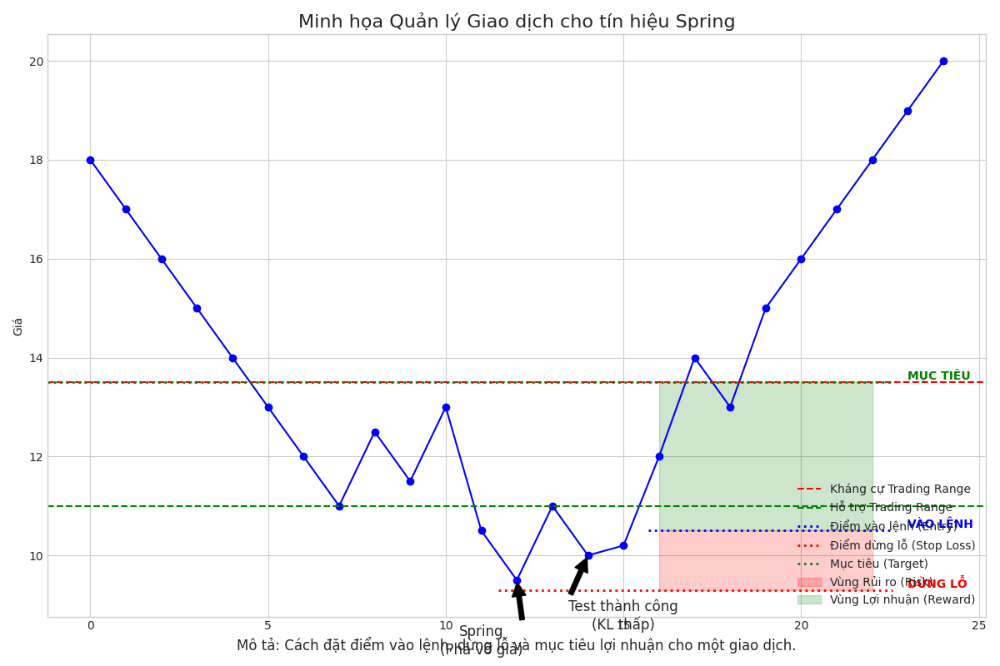
Một chiến lược giao dịch hoàn chỉnh phải có quy tắc rõ ràng cho các yếu tố này.

-   **Điểm Vào lệnh (Entry Points):**
    -   Trong **Giai đoạn Tích lũy:** Sau một **Spring** hoặc **Shakeout** đã được xác nhận bởi một **Test** với khối lượng thấp; tại các điểm **Last Point of Support (LPS)**; hoặc sau một **Sign of Strength (SOS)** khi giá pullback về vùng LPS/BU.
    -   Ví dụ với VN-Index (dữ liệu): Sau phiên SOS ngày 2025-05-26 (đóng cửa 1332.51), nếu trong các phiên tiếp theo, VN-Index có một đợt điều chỉnh giảm (pullback) về gần vùng 1315-1320 (vùng đỉnh cũ trước đó hoặc gần mức kháng cự vừa bị phá vỡ) với khối lượng giao dịch thấp, cho thấy lực bán yếu, đó có thể là một điểm LPS và là cơ hội vào lệnh mua.
    -   Trong **Giai đoạn Phân phối:** Sau một **Upthrust After Distribution (UTAD)** đã được xác nhận; tại các điểm **Last Point of Supply (LPSY)**.
    -   Dựa trên tín hiệu VPA cụ thể: Mua sau "**No Supply**" được xác nhận hoặc "**Test for Supply**" thành công; Bán sau "**Upthrust Bar**" hoặc "**No Demand**" tại kháng cự.

-   **Điểm Dừng lỗ (Stop-loss):**
    Nguyên tắc chung là đặt dừng lỗ tại điểm mà tín hiệu VPA hay sự kiện Wyckoff ban đầu bị vô hiệu hóa.
    -   Với lệnh mua sau **Spring:** Đặt dừng lỗ ngay bên dưới mức thấp nhất của Spring.
    -   Với lệnh mua tại **LPS:** Đặt dừng lỗ bên dưới mức thấp nhất của cấu trúc LPS hoặc mức hỗ trợ gần nhất.
    -   Ví dụ với VN-Index (dữ liệu): Nếu vào lệnh mua tại LPS quanh 1315-1320 sau SOS ngày 2025-05-26, điểm dừng lỗ có thể được đặt dưới đáy của đợt pullback đó, hoặc thận trọng hơn là dưới mức thấp nhất của phiên SOS (ví dụ, dưới 1288.86 – mức thấp nhất ngày 2025-05-26).
    -   Sử dụng chỉ số **ATR (Average True Range)** để đặt dừng lỗ (ví dụ, cách điểm vào 1.5 đến 2 lần ATR) giúp tránh bị "quét" bởi biến động nhiễu thông thường.

-   **Mục tiêu Lợi nhuận (Profit Targets):**
    -   Dựa trên các mức kháng cự/hỗ trợ lịch sử.
    -   Sử dụng nguyên tắc **Nguyên nhân - Kết quả** của Wyckoff: Độ rộng của Vùng Giao Dịch Tích lũy/Phân phối có thể giúp ước tính tiềm năng di chuyển của giá.
    -   Chốt lời từng phần khi giá đạt các mục tiêu trung gian hoặc khi xuất hiện tín hiệu VPA/Wyckoff ngược lại.
    Việc xác định trước các điểm này giúp loại bỏ yếu tố cảm tính và đảm bảo mỗi giao dịch đều có một tỷ lệ **Lợi nhuận/Rủi ro (Risk/Reward)** được tính toán. Ví dụ, nếu mua sau một Spring, điểm dừng lỗ được đặt ngay dưới đáy của Spring. Mục tiêu lợi nhuận đầu tiên có thể là đỉnh của Trading Range trước đó, và mục tiêu xa hơn có thể được ước tính dựa trên chiều rộng của vùng tích lũy nếu có một SOS mạnh mẽ xác nhận sự phá vỡ.

### **4.4. Quản trị Rủi ro Nâng cao: Chìa khóa Sống còn của Nhà giao dịch VPA**

Ngay cả phương pháp phân tích tốt nhất cũng sẽ có những giao dịch thua lỗ. Quản trị rủi ro chặt chẽ đảm bảo sự tồn tại và thành công bền vững.

-   **Quy tắc 1% (The One-Percent Rule):** Không bao giờ mạo hiểm hơn 1% (hoặc một tỷ lệ nhỏ khác do nhà đầu tư tự xác định) tổng vốn giao dịch cho một giao dịch đơn lẻ.
-   **Điều chỉnh Kích thước Vị thế (Position Sizing):** Đây là yếu tố cực kỳ quan trọng. Kích thước vị thế phải được xác định dựa trên khoảng cách từ điểm vào lệnh đến điểm dừng lỗ và Quy tắc % Rủi ro đã chọn. Công thức cơ bản:
    ```
    Kích_thước_Vị_thế = (Rủi_ro_Tài_khoản_mỗi_Giao_dịch) / (Khoảng_cách_Dừng_lỗ_mỗi_Cổ_phiếu)
    ```
    Trong đó, `Rủi_ro_Tài_khoản_mỗi_Giao_dịch = %Rủi_ro_Chấp_nhận * Tổng_Vốn_Tài_khoản`.
    Điều này đảm bảo rằng nếu giao dịch chạm điểm dừng lỗ, tổn thất sẽ không vượt quá mức đã định trước.
-   Luôn "**Lập kế hoạch giao dịch và giao dịch theo kế hoạch**": Mọi quyết định phải được xác định rõ ràng TRƯỚC KHI vào lệnh và tuân thủ nghiêm ngặt.
    Mục tiêu không phải là thắng mọi giao dịch, mà là đảm bảo các khoản thắng lớn hơn các khoản thua, và các khoản thua đủ nhỏ để không ảnh hưởng nghiêm trọng đến tài khoản. Quản trị rủi ro, đặc biệt là việc xác định kích thước vị thế dựa trên điểm dừng lỗ và tỷ lệ rủi ro trên mỗi giao dịch, là kỹ thuật quan trọng nhất để bảo vệ vốn và duy trì khả năng giao dịch lâu dài.

### **4.5. "Bẫy" trên Thị trường: Nhận diện và Đối phó với Tín hiệu Giả (False Signals)**

Không có phương pháp nào chính xác 100%, và tín hiệu giả là điều không thể tránh khỏi, đặc biệt trong thị trường biến động mạnh hoặc đi ngang không rõ xu hướng (**choppy markets**).

-   **Cách giảm thiểu tác động của tín hiệu giả:**
    -   **Xác nhận đa yếu tố:** Không hành động chỉ dựa trên một tín hiệu VPA đơn lẻ. Tìm kiếm sự đồng thuận từ nhiều tín hiệu VPA khác, sự kiện Wyckoff phù hợp, và có thể cả các chỉ báo kỹ thuật khác.
    -   **Phân tích đa khung thời gian:** Tín hiệu trên khung thấp sẽ đáng tin cậy hơn nếu phù hợp với bức tranh trên khung cao hơn.
    -   **Xem xét bối cảnh thị trường:** Một tín hiệu mua mạnh theo VPA xuất hiện giữa một thị trường đang giảm giá mạnh dài hạn có nhiều khả năng là **bẫy tăng giá (bull trap)** hơn là đảo chiều thực sự. **Richard Wyckoff** đã lưu ý rằng thị trường và các chứng khoán riêng lẻ không bao giờ hành xử giống hệt nhau hai lần, điều này ngụ ý sự cần thiết phải linh hoạt và không áp dụng máy móc các quy tắc.
    -   **Kiên nhẫn chờ đợi tín hiệu rõ ràng:** Đừng cố "ép" thị trường phải đưa ra tín hiệu. Giao dịch ít hơn nhưng chất lượng hơn thường mang lại kết quả tốt hơn.

-   **Khi gặp phải tín hiệu giả:**
    -   Chấp nhận sai một cách nhanh chóng và tuân thủ kế hoạch dừng lỗ đã đặt ra để cắt lỗ kỷ luật.
    -   Xem lại giao dịch, phân tích lý do tại sao tín hiệu lại là giả, và rút kinh nghiệm.
    Khả năng nhận diện và chấp nhận tín hiệu giả là một phần của quá trình trở thành chuyên gia. Mục tiêu không phải là loại bỏ hoàn toàn tín hiệu giả, mà là xây dựng một hệ thống giao dịch có lợi thế thống kê dương theo thời gian, kết hợp với quản lý rủi ro chặt chẽ. Sự khác biệt giữa nhà giao dịch chuyên nghiệp và nghiệp dư thường nằm ở cách họ phản ứng với các giao dịch thua lỗ: chuyên gia cắt lỗ nhanh chóng và học hỏi, trong khi nghiệp dư có thể cố chấp, dẫn đến những tổn thất lớn hơn.

---

## Phần 5: Hành trình Trở thành Chuyên gia Phân tích VPA – Rèn luyện và Phát triển Bền vững 🧘

Nắm vững lý thuyết VPA và Wyckoff là bước khởi đầu. Để thực sự trở thành chuyên gia áp dụng hiệu quả vào giao dịch hàng ngày, cần một quá trình rèn luyện kiên trì và học hỏi không ngừng.

### **5.1. Thực hành Chuyên sâu và Sức mạnh của Nhật ký Giao dịch**

Không có con đường tắt. Sự tinh thông đến từ việc dành thời gian nghiên cứu biểu đồ một cách tỉ mỉ, thực hành nhận diện mẫu hình Wyckoff và tín hiệu VPA trên nhiều loại tài sản và khung thời gian.

-   **Thực hành trên tài khoản giả lập (Demo account):** Trước khi mạo hiểm tiền thật, việc này giúp làm quen với việc áp dụng lý thuyết, kiểm tra chiến lược và tinh chỉnh phương pháp mà không chịu rủi ro tài chính.
-   **Ghi chép nhật ký giao dịch (Trading Journal):** Đây là công cụ cực kỳ mạnh mẽ. Mỗi giao dịch cần được ghi chép chi tiết: lý do vào lệnh (phân tích VPA/Wyckoff cụ thể, tín hiệu đã nhận diện), điểm vào lệnh, dừng lỗ, mục tiêu lợi nhuận, diễn biến giao dịch, kết quả cuối cùng, và quan trọng nhất là những bài học rút ra, điểm làm tốt và sai lầm cần khắc phục.
    Nhật ký giao dịch chính là tấm gương phản chiếu hành vi và quy trình tư duy của nhà giao dịch. Việc xem lại nhật ký thường xuyên giúp nhận ra các mẫu hình sai lầm lặp đi lặp lại của bản thân, từ đó có những điều chỉnh phù hợp. Nếu không ghi chép lại các phân tích và giao dịch, nhà đầu tư sẽ khó có thể học hỏi một cách có hệ thống từ kinh nghiệm của chính mình.

### **5.2. Không ngừng Học hỏi: Nguồn Tài liệu và Cộng đồng Hỗ trợ**

Để tiếp tục đào sâu kiến thức, việc tìm kiếm và nghiên cứu các nguồn tài liệu chất lượng là rất quan trọng.

-   **Sách của Anna Coulling:** Cuốn "**A Complete Guide to Volume Price Analysis**" là tài liệu cốt lõi.
-   **Các tác phẩm gốc của Richard Wyckoff:** Tìm đọc các bài viết, khóa học hoặc sách gốc của Wyckoff (hoặc các tài liệu biên soạn lại trung thực) sẽ mang lại hiểu biết sâu sắc nhất.
-   **Các cộng đồng và diễn đàn trực tuyến:** Tham gia các cộng đồng, diễn đàn của những nhà đầu tư cùng quan tâm đến VPA và Wyckoff là cách tốt để trao đổi kiến thức, chia sẻ kinh nghiệm. Ví dụ, trên các diễn đàn chứng khoán Việt Nam như F247.COM, đã có những thảo luận và phân tích về VN-Index theo phương pháp Wyckoff.
    Học VPA/Wyckoff là một hành trình liên tục. Việc tham gia vào một cộng đồng không chỉ giúp giải đáp thắc mắc mà còn cung cấp các góc nhìn đa dạng và các phân tích thực tế từ những người có cùng mục tiêu, qua đó có thể thúc đẩy nhanh quá trình học tập và giúp tránh được một số sai lầm thường gặp.

### **5.3. Rèn luyện Tư duy Phân tích VPA Sắc bén**

-   **Tập trung vào chất lượng, không phải số lượng tín hiệu:** Rèn luyện sự kiên nhẫn để chờ đợi những tín hiệu VPA/Wyckoff thực sự rõ ràng, có độ tin cậy cao và được xác nhận bởi nhiều yếu tố.
-   **Luôn giữ tư duy phản biện:** Đừng chấp nhận mọi thứ một cách thụ động. Hãy luôn đặt câu hỏi "Tại sao?" cho mỗi biến động giá và khối lượng quan trọng. Tại sao khối lượng lại tăng đột biến ở đây? Tại sao giá lại không thể vượt qua mức này mặc dù khối lượng lớn? Tư duy này giúp đào sâu sự hiểu biết thay vì chỉ áp dụng máy móc các quy tắc.
-   **Học từ sai lầm:** Coi mỗi sai lầm như một cơ hội để học hỏi. Phân tích kỹ lưỡng nguyên nhân và đảm bảo không lặp lại.
-   **Kiên nhẫn và kỷ luật là chìa khóa:** Thành công không đến từ việc tìm ra một "chén thánh", mà từ việc áp dụng nhất quán và kỷ luật một hệ thống phân tích đã được chứng minh, kết hợp với quản lý rủi ro chặt chẽ.
    Trở thành chuyên gia VPA không chỉ là thuộc lòng các quy tắc mà là phát triển một "cảm nhận" thị trường dựa trên các nguyên lý VPA/Wyckoff, có khả năng thích ứng với các điều kiện thị trường thay đổi. Các quy tắc là khung sườn, nhưng thị trường luôn có những sắc thái riêng.

---

## Phần 6: Nghiên cứu Tình huống Lịch sử VN-Index: Áp dụng VPA & Wyckoff vào Thực tế 📜

Phần này sẽ áp dụng toàn bộ kiến thức đã trình bày để phân tích các giai đoạn cụ thể và đáng chú ý của chỉ số VN-Index, minh họa cách các nguyên tắc VPA và mô hình Wyckoff biểu hiện trên thị trường chứng khoán Việt Nam.

### **6.1. Phân tích Giai đoạn Tích lũy Điển hình của VN-Index (Ví dụ: Sau COVID-19 2020 hoặc Tái tích lũy đầu 2024)**

Một giai đoạn tích lũy thường bắt đầu sau một xu hướng giảm kéo dài, nơi "**Composite Man**" bắt đầu mua gom cổ phiếu ở mức giá thấp. Quá trình này có thể được chia thành các pha như sau:

-   **Phase A (Ngừng xu hướng giảm):** Bắt đầu với **PS (Preliminary Support)**, nơi lực mua đầu tiên xuất hiện. Tiếp theo là **SC (Selling Climax)**, đặc trưng bởi sự bán tháo hoảng loạn, khối lượng giao dịch tăng vọt, nhưng giá đóng cửa thường hồi phục đáng kể từ mức thấp nhất, cho thấy "**Composite Man**" bắt đầu hấp thụ lượng cung lớn. Sau đó là **AR (Automatic Rally)**, một đợt hồi phục tự động xác định biên trên của vùng giao dịch (TR). Cuối cùng là **ST (Secondary Test)**, giá quay lại kiểm tra vùng đáy SC với khối lượng thấp hơn nếu đáy vững.
-   **Phase B (Xây dựng "Nguyên nhân"):** VN-Index dao động trong biên độ TR. Khối lượng thấp khi giá giảm về hỗ trợ ("**Test for Supply**", "**No Supply**") cho thấy lực bán yếu đi.
-   **Phase C (Kiểm tra cuối cùng):** Có thể xuất hiện **Spring/Shakeout** (phá vỡ giả xuống dưới TR rồi nhanh chóng hồi phục). Sau đó là **Test of Spring** với khối lượng rất thấp, xác nhận lực bán cạn kiệt. Đây là cơ hội mua tốt.
-   **Phase D (Xác nhận xu hướng tăng):** **SOS (Sign of Strength)** hay **JAC (Jump Across the Creek)** xảy ra khi VN-Index tăng mạnh, phá vỡ lên trên TR với khối lượng tăng mạnh. Sau đó có thể là **LPS (Last Point of Support)**, các đợt pullback về vùng kháng cự vừa phá vỡ với khối lượng thấp, là cơ hội mua cuối cùng.
-   **Phase E (Tăng giá):** VN-Index bắt đầu một xu hướng tăng rõ rệt.

Khối lượng đóng vai trò then chốt: rất cao tại SC, thấp hơn tại các ST và đặc biệt thấp tại Test of Spring, tăng mạnh trở lại tại SOS, và thấp tại các LPS. Một nhận định thường thấy là "Các điểm tạo đáy sẽ có Volume bật cao sau đó cạn kiệt dần. Tại điểm Break, Volume tăng đột biến".

Giai đoạn tích lũy thường kéo dài và đòi hỏi sự kiên nhẫn. Việc nhận diện chính xác các sự kiện quan trọng, đặc biệt là Spring và Test với khối lượng thấp, cung cấp cơ hội mua vào với rủi ro thấp trước khi xu hướng tăng chính bắt đầu. Hiểu rõ cấu trúc này giúp nhà đầu tư không mua quá sớm (trong Pha B) hoặc bỏ lỡ cơ hội khi thị trường bắt đầu tăng tốc (Pha D, E).

### **6.2. "Mổ xẻ" Giai đoạn Phân phối Đỉnh Lịch sử 2022 của VN-Index**
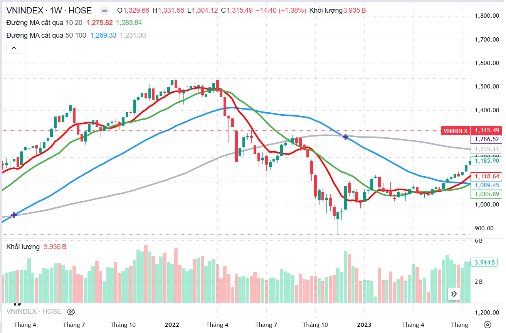
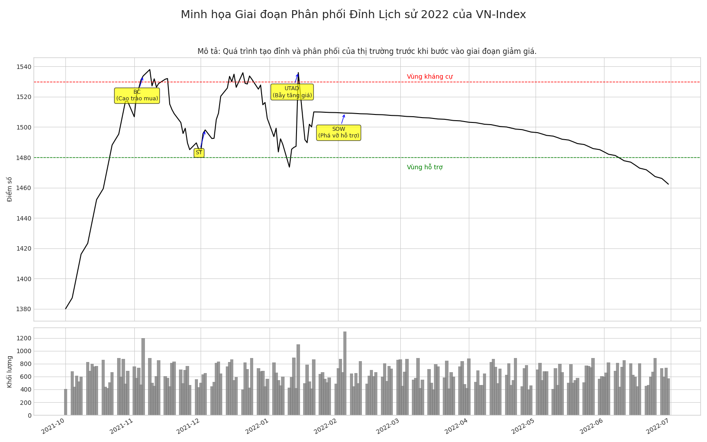
Giai đoạn cuối năm 2021 đến giữa năm 2022 là một ví dụ kinh điển về quá trình phân phối đỉnh của VN-Index, khi chỉ số đạt đỉnh lịch sử quanh 1500-1536 điểm vào tháng 1 năm 2022, sau đó là một đợt sụt giảm mạnh và kéo dài.

-   **Áp dụng Sơ đồ Phân phối Wyckoff:**
    -   **Phase A (Ngừng xu hướng tăng):** Bắt đầu với **PSY (Preliminary Supply)**, những dấu hiệu đầu tiên của lực bán lớn xuất hiện. Tiếp theo là **BC (Buying Climax)**, nơi lực mua của công chúng đạt đỉnh với sự hưng phấn cao độ, khối lượng giao dịch rất lớn, nhưng giá thường không giữ được đà tăng và có thể đóng cửa thấp hơn nhiều so với mức cao nhất trong phiên, cho thấy "**Composite Man**" đang bán ra mạnh mẽ. Sau BC là **AR (Automatic Reaction)**, một đợt giảm giá tự động xác định biên dưới của TR. Cuối cùng là **ST (Secondary Test)**, VN-Index hồi phục để kiểm tra lại vùng đỉnh BC, thường với khối lượng thấp hơn, cho thấy lực cầu yếu hơn. Có thể xuất hiện các tín hiệu VPA như "**Upthrust**" hoặc "**No Demand**" tại đây.
    -   **Phase B (Xây dựng "Nguyên nhân" cho xu hướng giảm):** VN-Index dao động trong biên độ được xác định bởi BC/ST (kháng cự) và AR (hỗ trợ). "**Composite Man**" tiếp tục phân phối cổ phiếu. Đặc điểm của giai đoạn này trên VN-Index có thể là "giá đảo chiều giảm mạnh trong phiên sau khi tăng đầu phiên (tạo bẫy tăng giá), đi kèm khối lượng giao dịch tăng cao đột biến trong những phiên giảm điểm đó; hoặc giá giao dịch giằng co quyết liệt giữa cung và cầu, khối lượng giao dịch tăng mạnh nhưng biến động giá lại không đáng kể hoặc giảm nhẹ". Đây là những biểu hiện của Pha B, nơi các "**bẫy tăng giá**" (**bull traps**) được tạo ra.
    -   **Phase C (Kiểm tra cuối cùng – thường là UTAD):** **UTAD (Upthrust After Distribution)** là một cú đẩy giá cuối cùng vượt lên trên vùng kháng cự của TR (có thể vượt qua đỉnh BC), tạo ra một "bẫy tăng giá" lớn để thu hút những người mua cuối cùng. Sau đó, VN-Index nhanh chóng suy yếu và rơi mạnh trở lại, thường với khối lượng lớn. Đây là một tín hiệu bán rất mạnh, báo hiệu giai đoạn phân phối sắp hoàn tất. Một số phân tích đã chỉ ra VN-Index có thể đã hình thành pha C phá vỡ các vùng giá quan trọng trước khi giảm sâu.
    -   **Phase D (Xác nhận xu hướng giảm):** **SOW (Sign of Weakness)** xảy ra khi VN-Index phá vỡ xuống dưới đường hỗ trợ của TR (vùng đáy AR), thường với biên độ nến giảm rộng và khối lượng tăng mạnh, xác nhận lực cung đã hoàn toàn chiếm ưu thế. Thời điểm VN-Index thủng các ngưỡng hỗ trợ quan trọng vào giữa tháng 4/2022 có thể được coi là một SOW. Sau SOW, có thể có **LPSY (Last Point of Supply)**, những đợt hồi phục yếu ớt về lại vùng hỗ trợ vừa bị phá vỡ (nay trở thành kháng cự mới), với khối lượng thấp hoặc khối lượng tăng nhưng giá không vượt qua được kháng cự, là cơ hội bán cuối cùng.
    -   **Phase E (Giảm giá):** VN-Index bước vào một xu hướng giảm giá mạnh và kéo dài.

-   **Phân tích các tín hiệu VPA trong giai đoạn này:** "**Topping Out Volume**" hoặc "**Potential Buying Climax**" tại vùng đỉnh BC; các nến "**Upthrust**" hoặc "**Pseudo Upthrust**" trong Pha B và đặc biệt là UTAD trong Pha C; các tín hiệu "**No Demand**" trong các đợt hồi phục yếu ớt; các nến "**Effort to Fall**" khi VN-Index phá vỡ các mức hỗ trợ quan trọng (SOW).
    Giai đoạn phân phối đỉnh 2022 của VN-Index là một minh chứng rõ ràng cho thấy các nguyên lý Wyckoff và VPA có thể được áp dụng hiệu quả trên thị trường Việt Nam. Các dấu hiệu cảnh báo đã xuất hiện trước khi thị trường sụt giảm mạnh, nhưng đòi hỏi kiến thức và kỹ năng để nhận diện. Việc nghiên cứu kỹ giai đoạn này giúp nhà đầu tư hiểu rằng các đỉnh lớn không hình thành trong một ngày mà là một quá trình có thể nhận diện được. Các tín hiệu như BC, UTAD, và SOW, kèm theo các đặc điểm khối lượng cụ thể, là những "cờ đỏ" mà nhà phân tích VPA được huấn luyện để tìm kiếm. Điều này giúp chuyển từ việc bị động chịu đựng "cú sập" sang chủ động nhận diện rủi ro và có hành động phù hợp.

### **6.3. Bài học Kinh nghiệm và Cách Áp dụng để Dự báo Chu kỳ Tương lai của VN-Index**

Từ việc phân tích các giai đoạn cụ thể của VN-Index, có thể rút ra những bài học quan trọng:

-   **Đặc điểm nhận dạng chính:**
    -   **Tích lũy:** Bắt đầu sau xu hướng giảm, đặc trưng bởi SC, AR, ST, Spring/Test, kết thúc bằng SOS/LPS. Khối lượng cao ở SC, thấp ở Test, tăng mạnh ở SOS. Tín hiệu VPA: **Stopping Volume, Test for Supply, No Supply**.
    -   **Phân phối:** Bắt đầu sau xu hướng tăng, đặc trưng bởi PSY, BC, AR, ST, UT/UTAD, kết thúc bằng SOW/LPSY. Khối lượng cao ở BC và UTAD, tăng mạnh khi phá vỡ hỗ trợ (SOW). Tín hiệu VPA: **Topping Out Volume, Upthrust, No Demand**.
-   **Tầm quan trọng của việc kết hợp VPA và Wyckoff:** Wyckoff cung cấp bức tranh tổng thể, VPA cung cấp công cụ chi tiết để xác nhận các sự kiện.
-   **Sự biến đổi của các mẫu hình:** Thị trường không lặp lại chính xác, cần nắm vững nguyên tắc và linh hoạt áp dụng.
-   **Cách tiếp cận để dự báo chu kỳ tương lai:**
    -   **Phân tích đa khung thời gian:** Bắt đầu từ khung lớn (Tuần, Tháng) rồi đến khung nhỏ hơn (Ngày, Giờ).
    -   **Theo dõi liên tục mối quan hệ Giá - Khối lượng:** Bất kỳ sự bất thường nào đều là tín hiệu cần chú ý.
    -   **Nhận diện các sự kiện Wyckoff sớm:** Cố gắng xác định SC, AR, BC, UTAD... ngay khi chúng bắt đầu hình thành.
    -   **Kiên nhẫn và kỷ luật:** Các giai đoạn tích lũy/phân phối có thể kéo dài. Chờ tín hiệu xác nhận rõ ràng.
    -   **Quản lý rủi ro:** Luôn chuẩn bị cho khả năng phân tích sai và có kế hoạch dừng lỗ.
    Mục tiêu cuối cùng không phải là dự đoán chính xác tuyệt đối mà là xây dựng một "tư duy phân tích" VPA/Wyckoff để đưa ra quyết định sáng suốt dựa trên bằng chứng thị trường. Lịch sử không lặp lại một cách chính xác, nhưng các nguyên tắc cơ bản về hành vi của "**Composite Man**" và quy luật cung cầu thì vẫn đúng. Bằng cách học từ các chu kỳ quá khứ, nhà đầu tư có thể nhận diện các dấu hiệu tương tự trong tương lai, từ đó cải thiện khả năng định thời điểm thị trường và quản lý rủi ro hiệu quả hơn.

---

## Kết luận: Trao quyền cho Nhà đầu tư Việt với VPA và Wyckoff 🎯

Phương pháp **Phân tích Giá và Khối lượng (VPA)** theo **Anna Coulling**, với nền tảng vững chắc từ các nguyên lý của **Richard Wyckoff**, cung cấp một lăng kính mạnh mẽ và sâu sắc để nhà đầu tư có thể "đọc vị" những động lực thực sự đằng sau các biến động của thị trường chứng khoán. Bằng cách tập trung vào mối quan hệ mật thiết giữa hành động giá và khối lượng giao dịch, VPA giúp nhận diện dấu chân của "**dòng tiền thông minh**", phân biệt giữa các động thái thị trường thực sự và những cái bẫy tiềm ẩn, từ đó đưa ra các quyết định giao dịch sáng suốt hơn.

Ba quy luật nền tảng của Wyckoff – **Cung và Cầu, Nguyên nhân và Kết quả, Nỗ lực và Kết quả** – cùng với khái niệm "**Composite Man**" và bốn giai đoạn của chu kỳ thị trường (**Tích lũy, Tăng giá, Phân phối, Giảm giá**) đã tạo nên một khung sườn lý thuyết toàn diện. Các sự kiện cụ thể trong từng giai đoạn Wyckoff, khi được kết hợp với các tín hiệu VPA đặc trưng, mang lại cho nhà phân tích những công cụ chẩn đoán thị trường vô cùng hiệu quả.

Việc áp dụng các nguyên tắc này vào phân tích chỉ số VN-Index và các cổ phiếu cụ thể, như đã được minh họa qua các ví dụ thực tế bao gồm dữ liệu giả định năm 2025 và phân tích chi tiết giai đoạn phân phối đỉnh lịch sử năm 2022, cho thấy tính thực tiễn và tiềm năng to lớn của phương pháp. Nó không chỉ giúp giải thích những gì đã xảy ra mà còn cung cấp những dấu hiệu cảnh báo sớm, giúp nhà đầu tư chủ động hơn trong việc quản lý vị thế và rủi ro.

Tuy nhiên, để thực sự trở thành một chuyên gia phân tích VPA, việc nắm vững lý thuyết là chưa đủ. Điều quan trọng hơn cả là quá trình thực hành kiên trì, ghi chép nhật ký giao dịch một cách cẩn thận, liên tục học hỏi từ cả thành công và thất bại, và luôn giữ một tư duy phản biện. Kết hợp VPA với phân tích đa khung thời gian, các công cụ kỹ thuật khác một cách hợp lý và đặc biệt là tuân thủ các nguyên tắc quản lý rủi ro chặt chẽ sẽ là những yếu tố then chốt để đạt được thành công bền vững.

Thị trường chứng khoán Việt Nam, với những đặc thù riêng nhưng vẫn tuân theo các quy luật cung cầu và tâm lý đám đông phổ quát, là một môi trường đầy tiềm năng để áp dụng phương pháp VPA và Wyckoff. Báo cáo này hy vọng đã cung cấp một lộ trình chi tiết và những kiến thức nền tảng vững chắc, khuyến khích quý vị độc giả tiếp tục con đường nghiên cứu, thực hành và không ngừng trau dồi để có thể tự tin giải mã những thông điệp ẩn chứa trong từng biến động giá và khối lượng của thị trường, hướng tới mục tiêu trở thành nhà phân tích VPA chuyên nghiệp và giao dịch hiệu quả hàng ngày.

---

## Nguồn Tham khảo 📚

-   Phân tích VPA theo Anna Coulling (Tài liệu tải lên)
-   PORT\_GROUP\_BIG\_CAP\_0.csv (Tài liệu tải lên)
-   QUÁ TRÌNH TÍCH LŨY (ACCUMULATION) :CÁC SỰ KIỆN..., [https://fibonacci.edu.vn/qua-trinh-tich-luy-accumulation-cac-su-kien-wyckoff/](https://fibonacci.edu.vn/qua-trinh-tich-luy-accumulation-cac-su-kien-wyckoff/)
-   Topic chia sẻ giao dịch phái sinh Index theo SMC Wyckoff - Dân ta mới bơi vào chém gió - F247.COM, [https://f247.com/t/topic-chia-se-giao-dich-phai-sinh-index-theo-smc-wyckoff-dan-ta-moi-boi-vao-chem-gio/643510](https://f247.com/t/topic-chia-se-giao-dich-phai-sinh-index-theo-smc-wyckoff-dan-ta-moi-boi-vao-chem-gio/643510)
-   How to Analyze Stock Market Trends Using VPA - Shortform, [https://www.shortform.com/books/blog/how-to-analyze-stock-market-trends.html](https://www.shortform.com/books/blog/how-to-analyze-stock-market-trends.html)
-   Đầu tư hiệu quả với Phương pháp Wyckoff - Tititada, [https://tititada.com/academy/dau-tu/dau-tu-hieu-qua-voi-phuong-phap-wyckoff](https://tititada.com/academy/dau-tu/dau-tu-hieu-qua-voi-phuong-phap-wyckoff)
-   Richard D.Wyckoff là ai? Tìm hiểu phương pháp của Wyckoff về phân tích thị trường, [https://www.dsc.com.vn/kien-thuc/tim-hieu-phuong-phap-cua-wyckoff-ve-phan-tich-thi-truong](https://www.dsc.com.vn/kien-thuc/tim-hieu-phuong-phap-cua-wyckoff-ve-phan-tich-thi-truong)
-   Mô hình biến động giá thu hẹp VCP thất bại trở thành phân phối của VNINDEX! - FireAnt, [https://fireant.vn/bai-viet/mo-hinh-bien-dong-gia-thu-hep-vcp-that-bai-tro-thanh-phan-phoi-cua-vnindex-/31643107](https://fireant.vn/bai-viet/mo-hinh-bien-dong-gia-thu-hep-vcp-that-bai-tro-thanh-phan-phoi-cua-vnindex-/31643107)
-   VNINDEX - Chỉ số VNINDEX | Biểu đồ giá và tổng quan - Simplize, [https://simplize.vn/chi-so/VNINDEX](https://simplize.vn/chi-so/VNINDEX)
-   VN-Index sinks below 1,100 points as market sell-off intensifies, [https://vietnamnews.vn/economy/1695510/vn-index-sinks-below-1-100-points-as-market-sell-off-intensifies.html](https://vietnamnews.vn/economy/1695510/vn-index-sinks-below-1-100-points-as-market-sell-off-intensifies.html)
